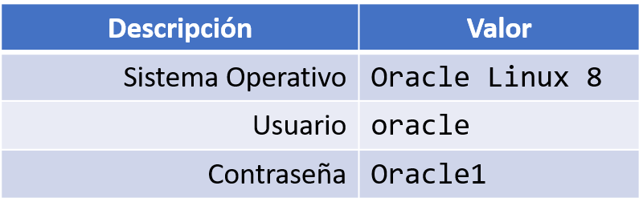
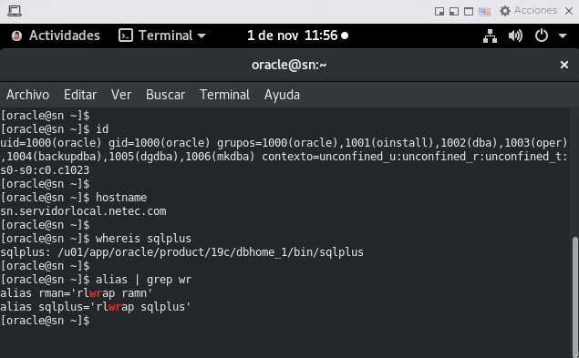

# **Práctica 1.1 Acceso al Entorno del Curso**


## **Objetivos**

* Acceder correctamente al equipo virtual o remoto asignado, según la modalidad del curso.
* Verificar el usuario actual y los grupos asociados.
* Comprobar los privilegios de superadministrador (root).
* Inspeccionar las particiones, el espacio en disco y la versión del sistema operativo.
* Familiarizarse con los comandos básicos de administración en Linux.

<br/><br/>

## **Duración estimada**

20 minutos

<br/><br/>

## **Tabla de Ayuda**

| Comando     | Descripción                                                      | Ejemplo o comentario                            |
| ----------- | ---------------------------------------------------------------- | ----------------------------------------------- |
| `id`        | Muestra el usuario actual y los grupos a los que pertenece.      | `id`                                            |
| `su - root` | Cambia al usuario superadministrador (root).                     | Contraseña: `Oracle1`                           |
| `mount -a`  | Lista las particiones montadas del sistema.                      | Debe mostrar los puntos de montaje disponibles. |
| `df`        | Muestra el uso y espacio disponible de los sistemas de archivos. | `df -h` muestra el tamaño en formato legible.   |
| `uname -a`  | Despliega información completa del sistema operativo.            | Incluye kernel, arquitectura y versión.         |

**Nota:** En BASH, el símbolo `$` representa el *prompt* del shell. El carácter `#` se utiliza para comentarios dentro de los comandos o scripts.

<br/><br/>

## **Objetivo Visual**

El objetivo es familiarizarse con el acceso al entorno Linux sobre el cual se realizarán las prácticas de Oracle Database.



<br/><br/>

## **Instrucciones**

### **Tarea 1. Acceso al entorno**

1. Según la modalidad del curso:

   * **Presencial:** inicia sesión directamente en el equipo asignado.
   * **Virtual:** accede de forma remota mediante la **URL o dirección IP/Puerto** indicada por tu instructor.

2. Utiliza las credenciales:

   * **Usuario:** `oracle`
   * **Contraseña:** `Oracle1`

3. Abre una terminal:

   * Desde el menú de actividades o haciendo clic derecho sobre el escritorio y seleccionando **“Abrir terminal”**.

<br/><br/>

### **Tarea 2. Verificación del usuario**

1. Ejecuta el siguiente comando para comprobar tu usuario actual y grupos asociados:

   ```bash
   $ id
   ```

<br/><br/>

### **Tarea 3. Acceso como superadministrador**

1. Cambia a la cuenta **root**:

   ```bash
   $ su - root
   ```
2. Ingresa la contraseña `Oracle1`.
3. Verifica que el *prompt* cambie de `$` a `#`, indicando que ahora eres superusuario.

<br/><br/>

### **Tarea 4. Comprobación del sistema**

1. Muestra las particiones y sistemas de archivos montados:

   ```bash
   # mount -a
   ```
2. Revisa el espacio disponible y utilizado:

   ```bash
   # df -h
   ```
3. Consulta la versión y arquitectura del sistema:

   ```bash
   # uname -a
   ```

4. Verifica el estado de LISTENER

   ```bash
   # lsnrctl status
   ```

4. Verifica las variables de ambiente asociadas a Oracle

   ```bash
   # env | grep -i oracle
   ```

5. Verifica los alias del comando `rlwrap`

   ```bash
   # alias | grep rlwrap
   ```

6. Verifica el acceso a `sqlplus`

   ```bash
   # whereis sqlplus
   # sqlplus hr/Oracle1
   ```

<br/><br/>


## **Resultado Esperado**

La captura de pantalla siguiente confirma que el entorno de Oracle está correctamente configurado, con alias funcionales y herramientas accesibles desde la cuenta del usuario oracle.
 
 


