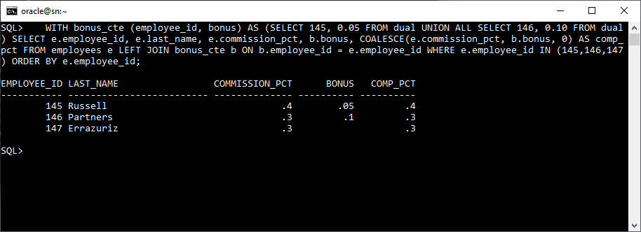

# **Práctica 1.3 Funciones de una sola fila, Fechas y Conversión**

## **Objetivos**

* Identificar la categoría de cada función (carácter, numérica, fecha, conversión) y su tipo de retorno.
* Formatear fechas y números con `TO_CHAR` usando *format models* comunes (`YYYY`, `RR`, `MON`, `DD`, `FM`, `999G999D00`, etc.).
* Convertir cadenas a fecha/número con `TO_DATE`/`TO_NUMBER` usando *format models* adecuados.
* Resolver escenarios con `NULL` eligiendo la función apropiada (comparar `NVL` vs `COALESCE` y `NULLIF`).
* Configurar la sesión (`NLS_TERRITORY`) para observar efectos en `NEXT_DAY` y nombres de día/mes.
* Validar y explicar casos límite con `YY` y `RR` (p. ej., años 49/50/99/00).

## **Duración estimada**

90–110 minutos.

## **Tabla de Ayuda**

> Sugerencia: abre cada referencia y tenla a la mano durante la práctica.

* **Funciones de cadena**: `LOWER`, `UPPER`, `INITCAP`, `SUBSTR`, `INSTR`, `LPAD/RPAD`, `TRIM`, `REPLACE`, `CONCAT`.
  Oracle® Database 19c SQL Language Reference → *Character Functions*
  [Character-Functions](https://docs.oracle.com/en/database/oracle/oracle-database/19/sqlrf/Single-Row-Functions.html#GUID-06062705-1EC8-44ED-89B8-0F0573B74EA2)
* **Funciones numéricas**: `ROUND`, `TRUNC`, `FLOOR`, `CEIL`, `MOD`.
  *Numeric Functions*
  [Numeric-Functions](https://docs.oracle.com/en/database/oracle/oracle-database/19/sqlrf/Single-Row-Functions.html#GUID-AC0E8A99-5097-4147-8295-C88EAC5AA362)
* **Funciones de fecha**: `ADD_MONTHS`, `NEXT_DAY`, `LAST_DAY`, `MONTHS_BETWEEN`, `SYSDATE`.
  *Datetime Functions*
  [Datetime-Functions](https://docs.oracle.com/en/database/oracle/oracle-database/19/lnoci/oci-date-datetime-and-interval-functions.html)
* **Conversión**: `TO_CHAR` (date/number), `TO_DATE`, `TO_NUMBER`.
  *Conversion Functions*
  [Conversion-Functions](https://docs.oracle.com/en/database/oracle/oracle-database/19/sqlrf/Single-Row-Functions.html#GUID-0E5115DD-F906-4F04-BB70-DF62DD4BBF91)
* **Format models** (fechas y números):
  [Format-Models](https://docs.oracle.com/en/database/oracle/oracle-database/19/sqlrf/Format-Models.html#GUID-DFB23985-2943-4C6A-96DF-DF0F664CED96)
* **NLS parámetros** (incluye `NLS_TERRITORY`, `NLS_DATE_LANGUAGE`):
  [NLS_TERITORY](https://docs.oracle.com/en/database/oracle/oracle-database/19/refrn/NLS_TERRITORY.html#GUID-161ABCAF-6095-4991-929A-B991A3642782)
* **Funciones con NULL**: `NVL`, `NVL2`, `NULLIF`, `COALESCE`.
  *Conditional Expressions / NULL-related*
  [Single-Row-Functions](https://docs.oracle.com/en/database/oracle/oracle-database/19/sqlrf/Single-Row-Functions.html)

<br/><br/>

## **Objetivo Visual**


| **Dato de entrada**    | **Función**                  | **Tipo devuelto**                    | **Notas**                              |
| ---------------------- | ---------------------------- | ------------------------------------ | -------------------------------------- |
| `CHAR`                 | `UPPER`, `SUBSTR`, `REPLACE` | `CHAR`                               | Manipulan cadenas de texto.            |
| `NUMBER`               | `ROUND`, `TRUNC`, `MOD`      | `NUMBER`                             | Realizan operaciones numéricas.        |
| `DATE`                 | `ADD_MONTHS`, `NEXT_DAY`     | `DATE`                               | Devuelven fechas ajustadas.            |
| `CHAR / DATE / NUMBER` | `TO_CHAR`                    | `CHAR` *(usa format model)*          | Convierte valores a texto formateado.  |
| `CHAR`                 | `TO_DATE`, `TO_NUMBER`       | `DATE / NUMBER` *(usa format model)* | Convierte texto al tipo especificado.  |
| `ANY`                  | `NVL`, `NVL2`, `COALESCE`    | Tipo del **primer valor no-NULL**    | Mantienen el tipo del valor retornado. |


**Regla de oro:** al *anidar*, valida el tipo que entra/sale de cada función.

<br/><br/>

## **Instrucciones**  

### **Tarea 0. Preparación y verificación rápida (HR)**

1. Conéctate a la BD como un usuario con acceso al esquema **HR**.
   `SELECT COUNT(*) FROM hr.employees;` (debe devolver filas > 0).
2. Guarda tu *script de trabajo* como `P13_funciones.sql`.

<br/><br/>

### **Tarea 1. Funciones de carácter**

1. Ejecuta y explica brevemente qué hace cada expresión y su tipo devuelto:

   ```sql
   SELECT 
     UPPER(last_name) AS up_last,
     SUBSTR(first_name, 1, 3) AS prefijo,
     INSTR(email,'@') AS at_pos,
     TRIM(' ' FROM '  HR  ') AS limpio
   FROM hr.employees
   FETCH FIRST 5 ROWS ONLY;
   ```
2. ¿`INSTR` devuelve `NUMBER` o `CHAR`? ¿Por qué?

<br/><br/>

### **Tarea 2. Funciones numéricas**

1. Practica con `salary` (NUMBER):

   ```sql
   SELECT 
     salary,
     ROUND(salary, -2) AS redondeo_cientos,
     TRUNC(salary,  1) AS trunc_1_decimal,
     MOD(salary, 500)  AS resto_500
   FROM hr.employees
   FETCH FIRST 5 ROWS ONLY;
   ```
2. Indica el *tipo devuelto* de cada columna calculada y si alguna puede ser `NULL`.

<br/><br/>

### **Tarea 3. Fechas y aritmética de fechas**

1. Observa la fecha actual y realiza aritmética:

   ```sql
   SELECT 
     SYSDATE AS hoy,
     SYSDATE + 7 AS dentro_7_dias,      -- suma días
     SYSDATE - 30 AS hace_30_dias,      -- resta días
     MONTHS_BETWEEN(SYSDATE, SYSDATE-60) AS meses_aprox
   FROM dual;
   ```
2. Explica por qué `SYSDATE + 7` sigue siendo `DATE` y no `NUMBER`.

<br/><br/>

### **Tarea 4. `TO_CHAR` con *format models***

1. Formatea fecha y número:

   ```sql
   SELECT
     TO_CHAR(SYSDATE, 'YYYY-MM-DD "T"HH24:MI:SS') AS iso_like,
     TO_CHAR(SYSDATE, 'Dy DD-Mon-YYYY', 'NLS_DATE_LANGUAGE=American') AS amigable_en,
     TO_CHAR(1234567.8, '999G999G999D00') AS numero_formateado
   FROM dual;
   ```
2. Cambia `NLS_DATE_LANGUAGE=Spanish` y observa abreviaturas de día/mes.

<br/><br/>

### **Tarea 5. `TO_DATE` / `TO_NUMBER` y `YY` vs `RR`**

1. Conversión con `YY`:

   ```sql
   SELECT TO_DATE('31-12-49','DD-MM-YY') AS d1,
          TO_DATE('01-01-50','DD-MM-YY') AS d2
   FROM dual;
   ```
2. Conversión con `RR` (compara con lo anterior):

   ```sql
   SELECT TO_DATE('31-12-49','DD-MM-RR') AS d1_rr,
          TO_DATE('01-01-50','DD-MM-RR') AS d2_rr
   FROM dual;
   ```
3. **Explica**: ¿Cómo determina Oracle el siglo con `YY` vs `RR`? Anota tu conclusión.

<br/><br/>

### **Tarea 6. `NVL`, `NVL2`, `NULLIF`, `COALESCE`**

1. Crea ejemplos con posibles `NULL`:

   ```sql
   SELECT
     commission_pct,
     NVL(commission_pct, 0) AS nvl_comm,
     NVL2(commission_pct, 'Tiene', 'No tiene') AS nvl2_txt,
     NULLIF(job_id, 'SA_REP') AS null_if_sa,
     COALESCE(TO_CHAR(commission_pct), 'SIN_COMISION') AS coalesce_txt
   FROM hr.employees
   WHERE ROWNUM <= 10;
   ```
2. **Ejercicio**: usando **`NULLIF`** y **`COALESCE`**, construye:

   * a) Una expresión que devuelva `NULL` cuando `salary` y `NVL(salary,0)` sean iguales, y el `salary` en otro caso.
   * b) Una expresión que elija en orden: `commission_pct`, si `NULL` use `bonus` (supón columna `bonus`), y si también es `NULL` use `0`. *(Si no existe `bonus`, crea una CTE con datos de prueba.)*

<br/><br/>

### **Tarea 7. `ADD_MONTHS` + `NEXT_DAY` con `NLS_TERRITORY`**

> **Clave para Preguntas 5/6**: Cambia `NLS_TERRITORY` y observa el *día de inicio de semana* y nombres de días.

1. Observa el efecto del territorio:

   ```sql
   ALTER SESSION SET NLS_TERRITORY = 'AMERICA';
   SELECT 
     SYSDATE AS hoy,
     ADD_MONTHS(SYSDATE, 1) AS +1_mes,
     NEXT_DAY(SYSDATE, 'MONDAY') AS prox_lunes_en
   FROM dual;
   ```
2. Cambia territorio y repite:

   ```sql
   ALTER SESSION SET NLS_TERRITORY = 'SPAIN';
   SELECT 
     SYSDATE AS hoy,
     ADD_MONTHS(SYSDATE, 1) AS +1_mes_es,
     NEXT_DAY(SYSDATE, 'LUNES') AS prox_lunes_es
   FROM dual;
   ```
3. **Pregunta guía**: ¿Por qué a veces `NEXT_DAY` falla si el nombre del día no coincide con el idioma de la sesión? ¿Cómo lo solucionas?

<br/><br/>

### **Tarea 8. Anidamiento y control de tipo devuelto**

1. Valida tipos al anidar:

   ```sql
   SELECT 
     TO_CHAR(ADD_MONTHS(TO_DATE('15-08-2025','DD-MM-YYYY'), 6), 'YYYY-MM-DD') AS fecha_sumada,
     LENGTH(TRIM(TO_CHAR(salary*1.15, '9999990D00'))) AS long_cadena_num
   FROM hr.employees
   FETCH FIRST 5 ROWS ONLY;
   ```
2. Indica el tipo devuelto de cada expresión **en cada paso** (escribe tu traza breve).

<br/><br/>

### **Tarea 9. Desafíos**

> Redacta sentencias y obtén el resultado correcto en tu sesión. Incluye el *query* y una nota explicando el razonamiento (1–2 líneas).

1. Muestra `last_name` en mayúsculas, recortado a 8 caracteres, y el **mes** de contratación en formato `MON` (en inglés) en una sola columna `emp_resumen`.
2. Calcula `salary` anual con 2 decimales y separador de miles, mostrada como texto (`TO_CHAR`), y agrega el código de departamento entre paréntesis: `1,234.50 (90)`.
3. Muestra empleados cuya fecha de contratación cae **el próximo viernes** respecto de `SYSDATE` al cambiar `NLS_TERRITORY` a un territorio europeo (demuestra la configuración y el filtro).
4. Devuelve una columna `salario_o_cero` que sea `salary` si no es `NULL`, y `0` en caso contrario, **sin usar `NVL`**.
5. Devuelve `NULL` si el `job_id` es `IT_PROG`; el mismo `job_id` en otro caso (**obligatorio con `NULLIF`**).
6. Convierte `'31/12/49'` con `YY` y con `RR` y muestra ambas fechas; explica diferencias de siglo.
7. Calcula la fecha **tres meses antes del último día del mes siguiente** a `SYSDATE` en formato `YYYY-MM-DD`.
8. Muestra el *primer lunes del mes próximo* en formato `DAY DD-MON-YYYY` con nombres de día/mes en español.
9. Construye una cadena con `last_name` y `salary` con formato monetario local (usa `TO_CHAR` numérico y **`G`/`D`**).
10. Muestra `COALESCE(commission_pct, bonus, 0)` con datos de prueba (usa una CTE si `bonus` no existe).

<br/><br/>

## **Resultado Esperado**

Al finalizar, debes entregar:

* Un archivo `P13_funciones.sql` con todos los *queries* ejecutables, organizados por tareas.
* Un archivo `P13_respuestas.txt` con:

  * Notas breves de tipo devuelto para cada expresión clave (especialmente tareas 5, 6 y 8).
  * Observaciones sobre los efectos de `NLS_TERRITORY` en `NEXT_DAY` (tarea 7).
  * Conclusión clara sobre `YY` vs `RR` (tarea 5).
* Evidencias (copias/pequeñas capturas o *spools*) de:

  * Aritmética de fechas (tarea 3).
  * Formateo con `TO_CHAR` (tarea 4).
  * Ejercicios con `NULLIF`/`COALESCE` (tarea 6).
  * Desafío (tarea 9): los 10 *queries* y su salida.


La captura muestra correctamente el resultado esperado del desafío: la función
COALESCE(commission_pct, bonus, 0) devuelve el primer valor no nulo entre la comisión, el bono o cero.
En este caso, los empleados con commission_pct existente usan ese valor (0.4 y 0.3), mientras que si faltara, habría tomado bonus o, en su defecto, 0.

