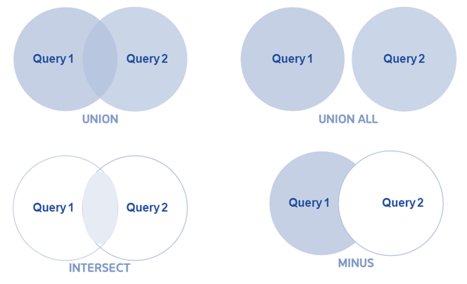
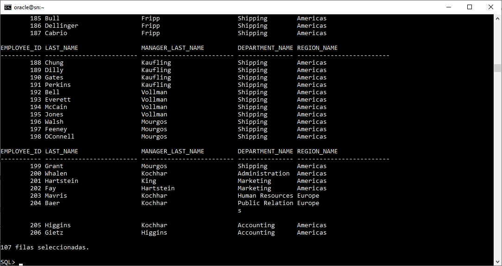

# **Práctica 1.5 Joins en Oracle SQL**

<br/><br/>

## **Objetivos**

* Diferenciar cuándo usar `NATURAL`, `USING` y `ON`, y justificar su elección.
* Construir equijoins y outer joins para resolver distintos escenarios del esquema HR.
* Detectar y evitar productos cartesianos no deseados.
* Implementar correctamente **self joins** (con **dos aliases obligatorios**) y explicar si el cruce es `INNER` u `OUTER`.
* Validar checkpoints: *un self join requiere dos aliases* y *un self join puede ser INNER u OUTER*.


## **Duración estimada**
   70–85 minutos.

<br/><br/>

## **Tabla de Ayuda**

| Concepto                | Descripción breve                                                         | Sintaxis base                               | Ejemplo HR                                            |
| ----------------------- | ------------------------------------------------------------------------- | ------------------------------------------- | -------------------------------------------------------------- |
| Equijoin (`=`)          | Une filas por igualdad de claves.                                         | `... FROM A a JOIN B b ON a.k=b.k`          | `employees` ↔ `departments` por `department_id`.               |
| `NATURAL JOIN`          | Une por todas las columnas **con el mismo nombre** en ambas tablas.       | `A NATURAL JOIN B`                          | Si ambas tienen `department_id`, se une por esa(s) columna(s). |
| `USING`                 | Une por columnas **mismo nombre** listadas y las expone **una sola vez**. | `A JOIN B USING (col)`                      | `employees JOIN departments USING (department_id)`.            |
| `ON`                    | Condición libre (columnas con nombre igual o distinto).                   | `A JOIN B ON (<cond>)`                      | `locations.country_id = countries.country_id`.                 |
| `LEFT/RIGHT/FULL OUTER` | Conserva filas de izquierda/derecha/ambas aunque no haya match.           | `A LEFT OUTER JOIN B ON ...`                | Empleados sin departamento (si existieran).                    |
| Producto cartesiano     | Todas las combinaciones; **aparece si no hay condición**.                 | `A CROSS JOIN B` o `FROM A,B` sin condición | 107 empleados × 27 deptos = 2889 filas (ejemplo).              |
| Self join               | Una tabla se une consigo misma; **requiere aliases**.                     | `A x JOIN A y ON ...`                       | `employees` (empleado) ↔ `employees` (manager).                |

<br/><br/>

> Recordatorio de uso:
>
> * **USING** solo se permite si el nombre de la(s) columna(s) coincide.
> * **NATURAL** selecciona **todas** las columnas homónimas (precaución con uniones involuntarias).
> * **ON** es el más flexible; preferirlo cuando los nombres difieren o la condición es compuesta.

<br/><br/>


 | Operador             | Descripción                                                                       | Comportamiento con duplicados |
| -------------------- | --------------------------------------------------------------------------------- | ----------------------------- |
| **UNION**            | Combina los resultados de dos consultas y elimina duplicados (resultado único).   | Elimina duplicados.           |
| **UNION ALL**        | Combina los resultados de dos consultas sin eliminar duplicados.                  | Mantiene duplicados.          |
| **INTERSECT**        | Devuelve las filas que aparecen en **ambas consultas**.                           | Elimina duplicados.           |
| **MINUS** *(Oracle)* | Devuelve las filas que aparecen en la **primera consulta** pero no en la segunda. | Elimina duplicados.           | 

<br/><br/>


## **Objetivo Visual**

Operadores de Conjuntos, son útiles para combinar resultados de consultas independientes

 

## **Instrucciones**

### **Tarea 0. Verificación del esquema HR**

1. Lista tablas clave: `employees, departments, locations, countries, regions, jobs, job_history`.
2. Describe columnas relevantes:

   * `employees(employee_id, first_name, last_name, manager_id, department_id, job_id, hire_date, salary, …)`.
   * `departments(department_id, department_name, manager_id, location_id)`.
   * `locations(location_id, city, country_id)`, `countries(country_id, region_id)`, `regions(region_id, region_name)`.
3. Identifica llaves de unión: `department_id`, `location_id`, `country_id`, `region_id`, y la **autorrelación** `manager_id`.

**Nota:** Identificaste correctamente la relación empleado–manager y que **self join requiere dos aliases**.

<br/><br/>

### **Tarea 1. Equijoins con `ON`**

1. Une empleados con departamentos (equijoin):

   ```sql
   SELECT e.employee_id, e.last_name, d.department_name
   FROM employees e
   JOIN departments d ON e.department_id = d.department_id;
   ```
2. Agrega `jobs` para ver el `job_title`:

   ```sql
   SELECT e.employee_id, e.last_name, d.department_name, j.job_title
   FROM employees e
   JOIN departments d ON e.department_id = d.department_id
   JOIN jobs j ON e.job_id = j.job_id;
   ```
3. Explica por qué aquí preferimos `ON` (nombres distintos o condición compuesta potencial).


<br/><br/>

### **Tarea 2. `USING` vs `NATURAL`**

1. Repite el join Empleado–Departamento con `USING`:

   ```sql
   SELECT e.employee_id, e.last_name, department_name
   FROM employees e
   JOIN departments d USING (department_id);
   ```

   Observa que `department_id` aparece **una sola vez** en el SELECT.

2. Ejecuta un `NATURAL JOIN` entre `departments` y `employees`:

   ```sql
   SELECT department_name, employee_id, last_name
   FROM departments NATURAL JOIN employees;
   ```

3. **Explica riesgos de `NATURAL`**: si en el futuro aparece otra columna homónima, la condición cambia implícitamente.

**Nota:** Diferencias claras entre `USING` (explícito) y `NATURAL` (implícito).

<br/><br/>

### **Tarea 3. Outer joins (LEFT/RIGHT/FULL)**

1. `LEFT OUTER`: todos los departamentos, tenga o no empleados.

   ```sql
   SELECT d.department_id, d.department_name, e.employee_id
   FROM departments d
   LEFT OUTER JOIN employees e ON e.department_id = d.department_id
   ORDER BY d.department_id, e.employee_id;
   ```

2. `RIGHT OUTER`: todos los empleados, incluso si su `department_id` no matchea (si existiera ese caso):

   ```sql
   SELECT d.department_id, d.department_name, e.employee_id
   FROM departments d
   RIGHT OUTER JOIN employees e ON e.department_id = d.department_id;
   ```

3. `FULL OUTER`: conserva ambos lados.

   ```sql
   SELECT d.department_id, d.department_name, e.employee_id
   FROM departments d
   FULL OUTER JOIN employees e ON e.department_id = d.department_id;
   ```

**Nota:** Puedes elegir el tipo de outer join adecuado según el requerimiento “conserva izquierda/derecha/ambas”.

<br/><br/>

### **Tarea 4. Producto cartesiano**

1. Provoca un cartesiano (controlado) y cuenta filas:

   ```sql
   SELECT COUNT(*) 
   FROM employees e CROSS JOIN departments d;
   -- Alternativa (no recomendado): FROM employees e, departments d;  -- sin condición
   ```

2. Añade condición `ON` y compara el conteo para verificar que eliminas el cartesiano.

**Nota:** Sabes detectar un cartesiano por conteo anormal y corregirlo con la condición de unión.

<br/><br/>

### **Tarea 5. Self join (INNER) — jerarquía empleado/manager**

1. Muestra empleado y su manager (requiere **dos aliases**):

   ```sql
   SELECT e.employee_id, e.last_name AS empleado,
          m.employee_id AS manager_id, m.last_name AS manager
   FROM employees e
   JOIN employees m ON e.manager_id = m.employee_id
   ORDER BY e.employee_id;
   ```
2. Explica por qué es **INNER** (solo empleados con manager definido aparecen).

**Nota:** Confirmas que **self join requiere dos aliases** y puede ser `INNER`.

<br/><br/>

### **Tarea 6. Self join (OUTER) — incluir empleados sin manager**

1. Conserva todos los empleados, aunque no tengan manager:

   ```sql
   SELECT e.employee_id, e.last_name AS empleado,
          m.employee_id AS manager_id, m.last_name AS manager
   FROM employees e
   LEFT OUTER JOIN employees m ON e.manager_id = m.employee_id
   ORDER BY e.employee_id;
   ```
2. Justifica por qué aquí **sí** es OUTER y qué problema resuelve (empleados raíz de la jerarquía).

**Nota:** Validaste que **un self join puede ser INNER u OUTER** según el requerimiento.

<br/><br/>

### **Tarea 7. Join multi-tabla con `ON` y condición compuesta**

1. Recorre departamento → ubicación → país → región:

   ```sql
   SELECT d.department_name, l.city, c.country_id, r.region_name
   FROM departments d
   JOIN locations l ON d.location_id = l.location_id
   JOIN countries c ON l.country_id = c.country_id
   JOIN regions r   ON c.region_id = r.region_id
   ORDER BY d.department_name;
   ```

2. Explica por qué `ON` es la opción natural aquí (nombres distintos en cadena).

**Nota:** Puedes encadenar varios joins con condiciones claras y orden lógico.

<br/><br/>

### **Tarea 8. Comparativa `USING` vs `ON` en SELECT list**

1. Con `USING (department_id)`, intenta seleccionar `e.department_id` → verifica el error; luego selecciona solo `department_id`.
2. Repite con `ON` y selecciona `e.department_id` y `d.department_id` para ver la diferencia.

**Nota:** Entiendes la **exposición de columnas** con `USING` (una sola) vs `ON` (puedes calificar cada lado).

<br/><br/>

### **Tarea 9. Desafíos**

Diseña **una sola consulta** que muestre:

* `employee_id`, `last_name` del empleado,
* `manager_last_name` (si existe),
* `department_name` (si existe),
* `region_name` del país donde se ubica el departamento (si existe).
  **Restricciones:**
* Debe ser **un solo SELECT** que combine **self join** y **outer joins** donde aplique.
* Usa **`ON`** cuando los nombres de columnas difieran y **justifica** (en un comentario al inicio del script) por qué no usaste `USING` o `NATURAL` en cada unión.
* Ordena por `employee_id`.
* Incluye en comentarios tus **justificaciones** de diseño.


<br/><br/>

## **Resultado Esperado**
   
La captura siguiente evidencia que la consulta integra correctamente un self join con varios outer joins, mostrando la relación completa entre empleado, gerente, departamento y región.

