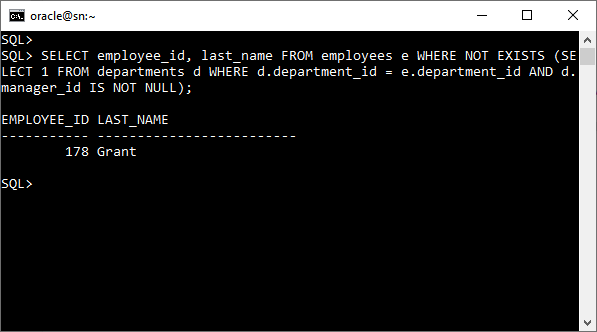

# **Práctica 1.6 Subqueries**

<br/><br/>

## **Objetivos**

* Comprender la diferencia entre subqueries simples, múltiples y correlacionadas.
* Utilizar correctamente los predicados `IN`, `NOT IN`, `EXISTS` y `NOT EXISTS`.
* Implementar subqueries escalares y de tupla.
* Aplicar los operadores `ANY` y `ALL` en comparaciones.
* Reescribir consultas `JOIN` como subqueries (y viceversa) para analizar equivalencias.

<br/><br/>


## **Duración estimada**

**60 minutos**

<br/><br/>


## **Tabla de Ayuda**

| Concepto            | Descripción                                                          | Referencia oficial                                                                                                                                                      |
| ------------------- | -------------------------------------------------------------------- | ----------------------------------------------------------------------------------------------------------------------------------------------------------------------- |
| Subquery            | Consulta anidada dentro de otra sentencia SQL.                       | [Oracle SQL Language Reference → Subqueries](https://docs.oracle.com/en/database/other-databases/timesten/22.1/sql-reference/subqueries.html) |
| Correlated Subquery | Subconsulta que depende de valores de la consulta principal.         | [Correlated Subqueries](https://docs.oracle.com/en/database/oracle/oracle-database/19/sqlrf/SELECT.html#GUID-CFA006CA-6FF1-4972-821E-6996142A51C6__I2066912)                  |
| IN / NOT IN         | Evalúan pertenencia de un valor en una lista o conjunto.             | [IN NOT IN](https://docs.oracle.com/en/database/oracle/oracle-database/26/sqlrf/IN-Condition.html) Conditions                                                                                                                          |
| EXISTS / NOT EXISTS | Verifican existencia o ausencia de filas devueltas por una subquery. | [EXISTS](https://docs.oracle.com/en/database/oracle/oracle-database/19/sqlrf/EXISTS-Condition.html) Condition                                                                                                                               |
| ANY / ALL           | Compara con algún o todos los valores devueltos por una subquery.    | [Quantified Comparison Conditions](https://docs.oracle.com/en/database/oracle/oracle-database/26/sqlrf/Comparison-Conditions.html#GUID-72CA75A4-AE94-471E-993F-20B969DB933F)                                                                                                              |
| Scalar Subquery     | Devuelve un solo valor (una columna y una fila).                     | [Scalar Subquery Expressions](https://docs.oracle.com/en/database/oracle/oracle-database/26/sqlrf/Scalar-Subquery-Expressions.html)                                                                                                                 |

<br/><br/>


## **Instrucciones**

<br/><br/>


### **Tarea 1. Identificar subqueries básicas**

1. Conéctate al esquema `HR`.
2. Consulta los empleados cuyo salario es **mayor al salario promedio** de todos los empleados.

   ```sql
   SELECT last_name, salary
   FROM employees
   WHERE salary > (SELECT AVG(salary) FROM employees);
   ```
3. Ejecuta la consulta y observa el resultado.
4. Explica por qué la subquery anterior es **escalar**.

<br/><br/>


### **Tarea 2. Subqueries de múltiples filas (IN / ANY / ALL)**

1. Muestra los empleados que trabajan en los mismos departamentos que los empleados con el cargo `'IT_PROG'`.

   ```sql
   SELECT employee_id, last_name, department_id
   FROM employees
   WHERE department_id IN (SELECT department_id FROM employees WHERE job_id = 'IT_PROG');
   ```
2. Reescribe la consulta anterior usando `= ANY(...)`.
3. Cambia la condición para encontrar a los empleados con salario **mayor que todos** los empleados con cargo `'IT_PROG'` (usa `> ALL`).

<br/><br/>


### **Tarea 3. Subquery correlacionada con EXISTS**

1. Muestra los empleados que tienen **al menos un subordinado** (usa la relación `manager_id`).

   ```sql
   SELECT e.employee_id, e.last_name
   FROM employees e
   WHERE EXISTS (
       SELECT 1 FROM employees s
       WHERE s.manager_id = e.employee_id
   );
   ```
2. Explica por qué esta subquery se evalúa **por cada fila** de la tabla externa.

<br/><br/>


### **Tarea 4. Comparación IN vs EXISTS**

1. Muestra los departamentos que tienen empleados asignados (usa `IN`).
2. Reescribe la misma consulta usando `EXISTS`.
3. Observa si el resultado cambia.
4. Explica en qué casos `EXISTS` puede ser más eficiente que `IN`.

<br/><br/>


### **Tarea 5. Subqueries de tupla**

1. Muestra el `employee_id`, `last_name` y `salary` de los empleados cuyo `(department_id, job_id)` coincida con el `(department_id, job_id)` de `'Den Raphaely'`.

   ```sql
   SELECT employee_id, last_name, department_id, job_id
   FROM employees
   WHERE (department_id, job_id) = (
       SELECT department_id, job_id
       FROM employees
       WHERE last_name = 'Raphaely'
   );
   ```

<br/><br/>


### **Tarea 6. Reescritura de JOIN ↔ Subquery**

1. Escribe una consulta que muestre el nombre del empleado y su nombre de departamento usando un `JOIN`.
2. Reescríbela usando una subquery en la cláusula `SELECT` o `WHERE`.
3. Compara los resultados y tiempos de ejecución si es posible.

<br/><br/>


### **Tarea 7. Subquery anidada de varios niveles**

1. Muestra el nombre de los empleados que ganan más que el promedio de los empleados de su propio departamento.

   ```sql
   SELECT e.last_name, e.salary, e.department_id
   FROM employees e
   WHERE e.salary > (
       SELECT AVG(salary)
       FROM employees
       WHERE department_id = e.department_id
   );
   ```
2. Explica por qué es una subquery correlacionada.

<br/><br/>


### **Tarea 8. Desafíos**

A partir del esquema **HR**, resuelve las siguientes situaciones utilizando el tipo de subquery y/o predicado que consideres más adecuado.


1. **Encuentra los empleados que trabajan en el mismo departamento que ‘Lex De Haan’.**
   *(¿Conviene una subquery escalar, de tupla o con IN?)*

2. **Muestra los empleados cuyo salario sea mayor que el salario promedio de todos los empleados.**
   *(¿Qué tipo de subquery te devuelve un solo valor?)*

3. **Lista los empleados que no pertenecen a ningún departamento con ubicación registrada en la tabla LOCATIONS.**
   *(¿Conviene usar NOT IN o NOT EXISTS?)*

4. **Muestra los departamentos que sí tienen empleados asignados.**
   *(Elige entre IN o EXISTS según rendimiento y semántica).*

5. **Obtén los empleados cuyo salario es mayor que el salario de *cualquier* empleado del departamento 30.**
   *(Decide entre ANY o ALL según el comparador.)*

6. **Muestra los empleados cuyo salario es mayor que el salario de *todos* los empleados del departamento 30.**
   *(Determina si el predicado adecuado es ANY o ALL.)*

7. **Identifica los empleados que tienen al menos un subordinado.**
   *(¿Qué tipo de subquery debe ejecutarse una vez por cada fila del conjunto externo?)*

8. **Lista los empleados que tienen el mismo puesto y departamento que ‘Den Raphaely’.**
   *(¿Qué forma de subquery permite comparar más de una columna?)*

9. **Muestra los departamentos cuyo salario promedio es mayor que el promedio general de la empresa.**
   *(Evalúa si es necesaria una subquery anidada o correlacionada.)*

10. **Encuentra los empleados que trabajan en departamentos que no tienen gerentes asignados.**
    *(Decide entre usar NOT EXISTS, NOT IN o una subquery correlacionada según el caso.)*

<br/><br/>

## **Resultado Esperado**

La captura de pantalla siguiente, muestra al empleado con EMPLOYEE_ID = 178 y apellido Grant trabaja en un departamento cuyo manager_id es NULL, es decir, un departamento sin gerente asignado.


