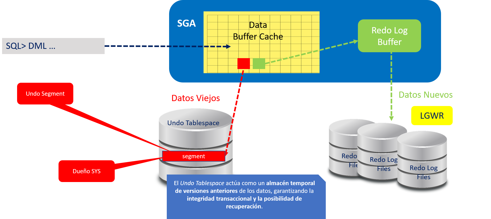

**Práctica 2.1 Usando DML para gestionar datos y transacciones**


## Objetivos

* Crear una tabla de práctica y comprobar su estructura.
* Insertar filas con y sin lista de columnas.
* Usar **scripts parametrizados** con variables de sustitución (`&var`) para insertar datos.
* Actualizar y eliminar filas de forma selectiva.
* Verificar resultados con consultas de control.
* Aplicar `COMMIT`, `ROLLBACK` y `SAVEPOINT` para gestionar transacciones.
* Dejar los cambios **persistidos** al finalizar.

<br/><br/>

## Duración estimada

**55–70 minutos**  

<br/><br/>

## Tabla de ayuda (referencias oficiales)

| Tema                 | Comando/Concepto | Sintaxis breve                            | Referencia oficial (Oracle 19c)                  |
| -------------------- | ---------------- | ----------------------------------------- | ------------------------------------------------ |
| Alta de registros    | `INSERT`         | `INSERT INTO t [(cols...)] VALUES (...);` | [SQL Language Ref — *INSERT Statement*](https://docs.oracle.com/en/database/oracle/oracle-database/19/sqlrf/INSERT.html)          |
| Modificación         | `UPDATE`         | `UPDATE t SET c=... WHERE ...;`           | [SQL Language Ref — *UPDATE Statement*](https://docs.oracle.com/en/database/oracle/oracle-database/19/sqlrf/UPDATE.html)            |
| Eliminación          | `DELETE`         | `DELETE FROM t WHERE ...;`                | [SQL Language Ref — *DELETE Statement*](https://docs.oracle.com/en/database/oracle/oracle-database/19/sqlrf/DELETE.html)           |
| Confirmación         | `COMMIT`         | `COMMIT;`                                 | [SQL Language Ref — *COMMIT Statement*](https://docs.oracle.com/en/database/oracle/oracle-database/19/sqlrf/COMMIT.html)           |
| Deshacer             | `ROLLBACK`       | `ROLLBACK;`                               | [SQL Language Ref — *ROLLBACK Statement*](https://docs.oracle.com/en/database/oracle/oracle-database/19/sqlrf/ROLLBACK.html)          |
| Punto intermedio     | `SAVEPOINT`      | `SAVEPOINT sp1;` / `ROLLBACK TO sp1;`     | [SQL Language Ref — *SAVEPOINT Clause*](https://docs.oracle.com/en/database/oracle/oracle-database/19/sqlrf/SAVEPOINT.html)            |
| Variables script     | Sustitución      | `INSERT INTO t VALUES (&p1, '&p2', ...);` | [SQL*Plus User’s Guide — *Substitution Variables* 21c](https://docs.oracle.com/en/database/oracle/oracle-database/21/sqpug/using-substitution-variables-sqlplus.html#GUID-0BEEC1D7-876B-495C-9327-17037652D3D2) |
| Describir estructura | `DESC`           | `DESC tabla;`                             | [SQL*Plus User’s Guide — *DESCRIBE Command*](https://docs.oracle.com/en/database/oracle/oracle-database/19/sqpug/DESCRIBE.html)       |
| Consultar            | `SELECT`         | `SELECT ... FROM ... WHERE ...;`          | [SQL Language Ref — *SELECT Statement*](https://docs.oracle.com/en/database/oracle/oracle-database/19/sqlrf/sql-language-reference.pdf)            |


<br/><br/>

## Objetivo visual

**Diagrama “Ciclo DML y Transacciones”**: muestra el flujo `INSERT/UPDATE/DELETE → Buffer Cache → Redo → SAVEPOINT → ROLLBACK/COMMIT`, destacando que el dato no es permanente hasta **COMMIT**.


<br/><br/>

## Instrucciones 

> **Entorno**: conéctate con un usuario con permisos de creación de objetos en tu instancia de práctica. No modifiques tablas del esquema HR de forma directa.

### Tarea 1. Preparación de la tabla de práctica

1. Ejecuta el script de limpieza indicado en las notas previas.

2. Crea una tabla de práctica basada en un subconjunto de columnas de HR.EMPLOYEES:

   ```sql
   DROP TABLE emp_dml PURGE;

   CREATE TABLE emp_dml (
     emp_id      NUMBER       CONSTRAINT pk_emp_dml PRIMARY KEY,
     first_name  VARCHAR2(20),
     last_name   VARCHAR2(25) NOT NULL,
     email       VARCHAR2(50) UNIQUE,
     salary      NUMBER(8,2)
   );
   ```

3. Verifica la estructura:

   ```sql
   DESC emp_dml;
   ```

<br/><br/>

### Tarea 2. Primera inserción **sin** lista de columnas

1. Inserta **una** fila sin listar columnas (respeta el orden de definición):

   ```sql
   INSERT INTO emp_dml
   VALUES (1, 'Alice', 'Adams', 'aadams@example.com', 950);
   ```

2. Confirma la existencia de la fila:

   ```sql
   SELECT * FROM emp_dml ORDER BY emp_id;
   ```

<br/><br/>

### Tarea 3. Inserciones **con** lista de columnas

1. Inserta dos filas listando las columnas de forma explícita:

   ```sql
   INSERT INTO emp_dml (emp_id, first_name, last_name, email, salary)
   VALUES (2, 'Bob', 'Bennet', 'bbennet@example.com', 1200);

   INSERT INTO emp_dml (emp_id, first_name, last_name, email, salary)
   VALUES (3, 'Carol', 'Dancs', 'cdancs@example.com', 800);
   ```

2. Comprueba los cambios:

   ```sql
   SELECT emp_id, first_name, last_name, salary FROM emp_dml ORDER BY emp_id;
   ```

<br/><br/>

### Tarea 4. Script **parametrizable** para inserción (variables de sustitución)

1. Crea un archivo `ins_emp_dml.sql` con el siguiente contenido:

   ```sql
   PROMPT Insertando registro en EMP_DML...
   INSERT INTO emp_dml (emp_id, first_name, last_name, email, salary)
   VALUES (&p_emp_id, '&p_first', '&p_last', '&p_email', &p_salary);
   ```

2. Ejecuta el script dos veces para cargar **dos filas más** (ejemplo):

   * Ejecución 1 (ejemplo de valores):

     ```
     p_emp_id=4
     p_first=Frank
     p_last=Drexler
     p_email=ddrexler@example.com
     p_salary=1100
     ```
   * Ejecución 2:

     ```
     p_emp_id=5
     p_first=Igor
     p_last=Dancs
     p_email=bdancs@example.com
     p_salary=700
     ```

3. Verifica:

   ```sql
   SELECT emp_id, first_name, last_name, email, salary
   FROM emp_dml ORDER BY emp_id;
   ```
<br/><br/>

### Tarea 5. Persistir las inserciones

1. Ejecuta:

   ```sql
   COMMIT;
   ```

2. Confirma que las filas permanecen:

   ```sql
   SELECT COUNT(*) filas FROM emp_dml;
   ```

<br/><br/>

### Tarea 6. Actualizaciones y eliminaciones

1. Cambia el **apellido** del empleado con `emp_id = 3` a **Drexler**:

   ```sql
   UPDATE emp_dml
   SET last_name = 'Drexler'
   WHERE emp_id = 3;
   ```

2. Asigna salario **1000** a quienes ganen **< 900**:

   ```sql
   UPDATE emp_dml
   SET salary = 1000
   WHERE salary < 900;
   ```

3. Revisa:

   ```sql
   SELECT emp_id, last_name, salary FROM emp_dml ORDER BY emp_id;
   ```

4. Elimina a **Igor Dancs** (si tu `emp_id` es 5, ajusta según tus datos):

   ```sql
   DELETE FROM emp_dml
   WHERE first_name = 'Igor' AND last_name = 'Dancs';
   ```

5. Comprueba:

   ```sql
   SELECT emp_id, first_name, last_name FROM emp_dml ORDER BY emp_id;
   ```

6. Confirma:

   ```sql
   COMMIT;
   ```

<br/><br/>
#
## Tarea 7. Control fino de transacciones con `SAVEPOINT`

> Realiza esta tarea **en una sola sesión** para apreciar el efecto.

1. Inserta **una** nueva fila usando tu script `ins_emp_dml.sql` (por ejemplo `emp_id=6`). **No hagas COMMIT** todavía.

2. Confirma que la fila aparece:

   ```sql
   SELECT * FROM emp_dml WHERE emp_id = 6;
   ```

3. Crea un punto de guardado:

   ```sql
   SAVEPOINT sp_alta;
   ```

4. Borra **todas** las filas:

   ```sql
   DELETE FROM emp_dml;
   SELECT COUNT(*) total FROM emp_dml;  -- Debe ser 0
   ```

5. Revierte **solo** lo posterior al punto:

   ```sql
   ROLLBACK TO sp_alta;
   ```

6. Verifica que la fila con `emp_id = 6` **sigue** en la tabla y el resto vuelve al estado anterior al `DELETE`:

   ```sql
   SELECT COUNT(*) total, MIN(emp_id) min_id, MAX(emp_id) max_id FROM emp_dml;
   SELECT * FROM emp_dml WHERE emp_id = 6;
   ```

7. Confirma definitivamente:

   ```sql
   COMMIT;
   ```

<br/><br/>

### **Tarea 8. Desafío**

* Modifica `ins_emp_dml.sql` para **generar `email` automáticamente** concatenando:

  * la **primera letra** de `first_name` + los **primeros 7 caracteres** de `last_name`, en **minúsculas**, y el sufijo `@example.com`.
* Pista (una opción): usa funciones `LOWER`, `SUBSTR` y concatenación `||`; convierte el script para **no pedir** `&p_email`.
* Inserta con el script un registro de prueba y verifica que el `email` se generó como se esperaba.
  Ejemplo esperado para `First=María`, `Last=Hernandez` → `mhernand@example.com`.

<br/><br/>

## Resultado Esperado

* **Tabla creada** (`EMP_DML`) con PK y una restricción `UNIQUE` sobre `email`.
* **Altas** realizadas con y sin lista de columnas, y mediante **script parametrizable**.
* **Cambios** aplicados correctamente (apellido actualizado, salarios ajustados).
* **Bajas** ejecutadas selectivamente.
* Demostración del **control transaccional**: uso de `SAVEPOINT`, `ROLLBACK TO`, verificación de efectos y persistencia con `COMMIT`.
* **Desafío** completado con el `email` autogenerado en minúsculas, sin solicitarlo por variable.

 
