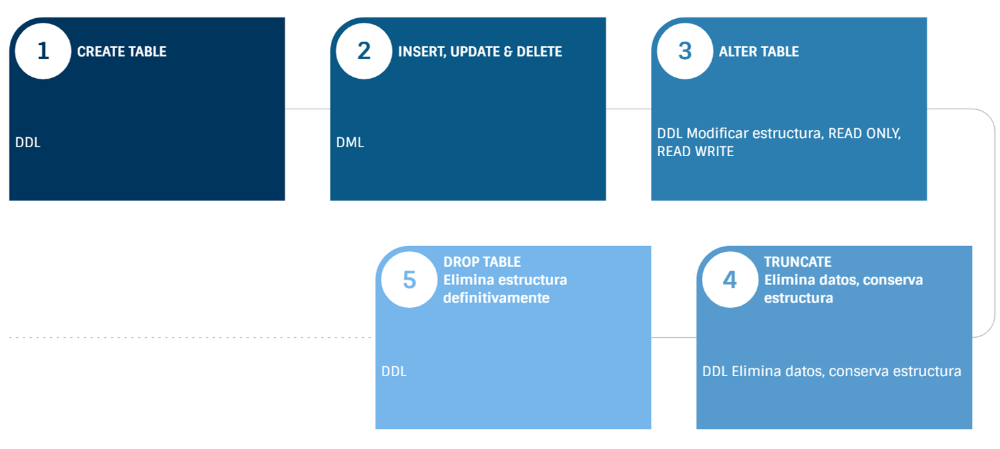

# **Práctica 2.2 Usando DDL para definir y modificar estructuras de tablas**

## **Objetivos**

* Crear nuevas tablas utilizando la sentencia `CREATE TABLE`.
* Verificar la existencia y estructura de tablas mediante las vistas del diccionario de datos.
* Modificar la estructura de tablas con `ALTER TABLE` (añadir o eliminar columnas).
* Establecer el modo **READ ONLY** y restaurar el modo **READ WRITE**.
* Eliminar estructuras con `DROP` y limpiar datos con `TRUNCATE`.
* Comprender que los comandos DDL **confirman los cambios automáticamente** (COMMIT implícito).

<br/><br/>

## **Duración estimada**

**60 a 75 minutos** 

<br/><br/>

## **Tabla de ayuda**

| Tema                   | Comando / Concepto                | Sintaxis breve                                 | Referencia oficial (Oracle 19c)           |
| ---------------------- | --------------------------------- | ---------------------------------------------- | ----------------------------------------- |
| Crear tabla            | `CREATE TABLE`                    | `CREATE TABLE t (col tipo [constraint], ...);` | [*SQL Language Reference — CREATE TABLE*](https://docs.oracle.com/en/database/oracle/oracle-database/19/sqlrf/CREATE-TABLE.html)   |
| Copiar tabla existente | `CREATE TABLE AS SELECT`          | `CREATE TABLE t_new AS SELECT * FROM t_old;`   | [*SQL Language Reference — CTAS*](https://docs.oracle.com/en/database/oracle/oracle-database/19/sqlrf/CREATE-TABLE.htm)           |
| Agregar columna        | `ALTER TABLE ... ADD`             | `ALTER TABLE t ADD (col tipo);`                | [*SQL Language Reference — ALTER TABLE*](https://docs.oracle.com/en/database/oracle/oracle-database/19/sqlrf/ALTER-TABLE.html#GUID-552E7373-BF93-477D-9DA3-B2C9386F2877)    |
| Eliminar columna       | `ALTER TABLE ... DROP COLUMN`     | `ALTER TABLE t DROP COLUMN col;`               | [*SQL Language Reference — ALTER TABLE*](https://docs.oracle.com/en/database/oracle/oracle-database/19/sqlrf/ALTER-TABLE.html#GUID-552E7373-BF93-477D-9DA3-B2C9386F2877)    |
| Estado de tabla        | `ALTER TABLE ... READ ONLY`       | `ALTER TABLE t READ ONLY;`                     | [*SQL Language Reference — ALTER TABLE*](https://docs.oracle.com/en/database/oracle/oracle-database/19/sqlrf/ALTER-TABLE.html#GUID-552E7373-BF93-477D-9DA3-B2C9386F2877)    |
| Eliminar tabla         | `DROP TABLE`                      | `DROP TABLE t [PURGE];`                        | [*SQL Language Reference — DROP TABLE*](https://docs.oracle.com/en/database/oracle/oracle-database/19/sqlrf/DROP-TABLE.html#GUID-39D89EDC-155D-4A24-837E-D45DDA757B45)     |
| Vaciar tabla           | `TRUNCATE TABLE`                  | `TRUNCATE TABLE t;`                            | [*SQL Language Reference — TRUNCATE TABLE*](https://docs.oracle.com/en/database/oracle/oracle-database/19/sqlrf/TRUNCATE-TABLE.html#GUID-B76E5846-75B5-4876-98EC-439E15E4D8A4) |
| Diccionario de datos   | `USER_TABLES`, `USER_TAB_COLUMNS` | `SELECT table_name FROM user_tables;`          | [*Database Reference — USER_* Views](https://docs.oracle.com/en/database/oracle/oracle-database/19/cncpt/data-dictionary-and-dynamic-performance-views.html#GUID-6F1EA52F-C3AF-407C-B4FA-AE8C8651055E)       |


<br/><br/>

## **Objetivo visual**

**Diagrama: “Ciclo de vida de una tabla en Oracle Database”**



> Este ciclo ilustra cómo el DBA o desarrollador controla la definición de los objetos a lo largo de su vida útil.

<br/><br/>

## **Instrucciones**

> **Entorno:** Oracle Database 19c, usuario HR (o usuario con permisos equivalentes).
> Usa SQL Developer o SQL*Plus. Guarda tus scripts como respaldo.

<br/><br/>

### **Tarea 1. Creación de una tabla básica**

1. Conéctate como usuario **HR**.

2. Crea una nueva tabla para registrar cursos:

   ```sql
   CREATE TABLE hr_cursos (
     id_curso     NUMBER(4) CONSTRAINT pk_cursos PRIMARY KEY,
     nombre       VARCHAR2(50) NOT NULL,
     duracion     NUMBER(3),
     costo        NUMBER(8,2),
     fecha_inicio DATE DEFAULT SYSDATE
   );
   ```

3. Verifica su creación:

   ```sql
   SELECT table_name FROM user_tables WHERE table_name = 'HR_CURSOS';
   ```

4. Describe la estructura:

   ```sql
   DESC hr_cursos;
   ```

<br/><br/>

### **Tarea 2. Crear tabla a partir de otra existente (CTAS)**

1. Crea una tabla llamada `empleados_temp` con los empleados actuales de HR:

   ```sql
   CREATE TABLE empleados_temp AS
   SELECT employee_id, first_name, last_name, salary, department_id
   FROM employees
   WHERE department_id = 80;
   ```

2. Comprueba los datos:

   ```sql
   SELECT COUNT(*) AS total_registros FROM empleados_temp;
   ```

3. Revisa columnas y tipos:

   ```sql
   DESC empleados_temp;
   ```

<br/><br/>

### **Tarea 3. Alterar una tabla**

1. Agrega una columna **“instructor”** a `hr_cursos`:

   ```sql
   ALTER TABLE hr_cursos ADD (instructor VARCHAR2(50));
   ```

2. Comprueba que fue agregada:

   ```sql
   SELECT column_name FROM user_tab_columns
   WHERE table_name = 'HR_CURSOS';
   ```

3. Elimina la columna **duracion**:

   ```sql
   ALTER TABLE hr_cursos DROP COLUMN duracion;
   ```

4. Vuelve a describir la tabla para verificar el cambio:

   ```sql
   DESC hr_cursos;
   ```

<br/><br/>

### **Tarea 4. Cambiar estado de la tabla (READ ONLY / READ WRITE)**

1. Cambia la tabla a modo solo lectura:

   ```sql
   ALTER TABLE hr_cursos READ ONLY;
   ```

2. Intenta insertar un registro:

   ```sql
   INSERT INTO hr_cursos VALUES (10, 'PL/SQL Avanzado', NULL, 800, SYSDATE, 'Rodrigo');
   ```

   *Debería generar un error ORA-12081 (tabla de solo lectura).*

3. Regresa la tabla al modo lectura-escritura:

   ```sql
   ALTER TABLE hr_cursos READ WRITE;
   ```

4. Ahora repite la inserción:

   ```sql
   INSERT INTO hr_cursos (id_curso, nombre, costo, instructor)
   VALUES (10, 'PL/SQL Avanzado', 800, 'Rodrigo');
   ```

5. Verifica:

   ```sql
   SELECT * FROM hr_cursos;
   ```

<br/><br/>

### **Tarea 5. Vaciar y eliminar tablas**

1. Vacía `empleados_temp` sin eliminar su estructura:

   ```sql
   TRUNCATE TABLE empleados_temp;
   ```

   Verifica que no tiene registros:

   ```sql
   SELECT COUNT(*) FROM empleados_temp;
   ```

2. Elimina definitivamente la tabla:

   ```sql
   DROP TABLE empleados_temp PURGE;
   ```

3. Comprueba que ya no existe:

   ```sql
   SELECT table_name FROM user_tables
   WHERE table_name = 'EMPLEADOS_TEMP';
   ```

<br/><br/>

### **Tarea 6. Desafío**

1. Crea una tabla llamada `historial_cursos` copiando la estructura de `hr_cursos` pero sin datos.
2. Añade una columna llamada `fecha_registro` con valor por defecto `SYSDATE`.
3. Inserta algunos registros manualmente.
4. Cambia la tabla a modo **READ ONLY**.
5. Intenta modificar un registro para observar el error.
6. Regresa la tabla a **READ WRITE** y elimina una columna.
7. Finaliza eliminando la tabla con `DROP TABLE historial_cursos PURGE;`.

<br/><br/>

## **Resultado Esperado**

* Se crean correctamente las tablas `HR_CURSOS` y `EMPLEADOS_TEMP`.
* Se comprueba el funcionamiento de los comandos `ALTER`, `TRUNCATE` y `DROP`.
* Se entiende que los comandos DDL **confirman automáticamente** sus efectos.
* Se demuestra la diferencia entre **READ ONLY** y **READ WRITE**.
* El participante completa el **desafío** mostrando el ciclo de vida de una tabla en Oracle Database.
