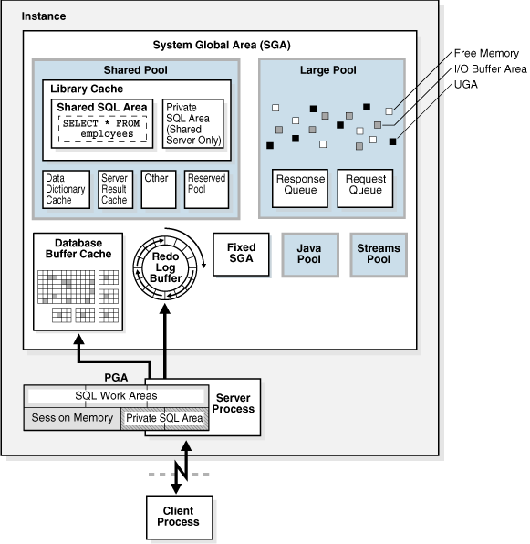

# **Práctica 3.1 Quiz**

## **Objetivos**

Reafirmar los conocimientos teóricos de terminología y conceptos fundamentales relacionados con bases de datos Oracle.

  

## **Duración estimada**

15 minutos

  

## **Tabla de Ayuda**

| Concepto                 | Descripción breve                                                                 | Referencia oficial                                                                                                      |
| ------------------------ | --------------------------------------------------------------------------------- | ----------------------------------------------------------------------------------------------------------------------- |
| **Base de datos Oracle** | Conjunto de datos estructurados administrados por Oracle Database Server.         | [Oracle Database Concepts](https://docs.oracle.com/cd/F39414_01/cncpt/database-concepts.pdf)                        |
| **Instancia Oracle**     | Conjunto de procesos y memoria que gestionan el acceso a la base de datos.        | [Database Architecture](https://docs.oracle.com/cd/F19136_01/nonpub_db_techarch/pdf/db-19c-architecture.pdf) |
| **Tablespace**           | Unidad lógica de almacenamiento dentro de la base de datos.                       | [Tablespaces](https://docs.oracle.com/en/database/oracle/oracle-database/26/admin/managing-tablespaces.html#GUID-9A3CE861-80FE-4813-B496-287B69A79C46)                     |
| **Schema**               | Colección de objetos (tablas, vistas, índices, etc.) pertenecientes a un usuario. | [Schemas and Users](https://docs.oracle.com/en/database/oracle/oracle-database/19/cncpt/introduction-to-oracle-database.html#GUID-ACACFFBC-BCB9-4BA9-A2A3-1B9B2003B3B4)         |

**Nota:** Esta práctica no requiere ejecución en SQL Developer o terminal; su propósito es evaluar tu comprensión conceptual previa a las prácticas técnicas.

  

## **Objetivo Visual**

[source](https://docs.oracle.com/en/database/oracle/oracle-database/19/cncpt/memory-architecture.html#GUID-02378E7A-865B-456B-8725-1E73D16A34BE)

  

## **Instrucciones**

### **Tarea 1. Acceso al cuestionario**

1. Abre el enlace proporcionado por el instructor:
    [https://forms.gle/GsKnXGfSKWYupkBUA](https://forms.gle/GsKnXGfSKWYupkBUA)

2. Resuelve el cuestionario teórico seleccionando la respuesta correcta en cada pregunta.

3. Espera a que tus compañeros finalicen su entrega.

4. El instructor compartirá los resultados grupales y reforzará los conceptos no dominados.
  
  

## **Resultado Esperado**

Captura de pantalla que muestre la confirmación de envío del formulario completado.

