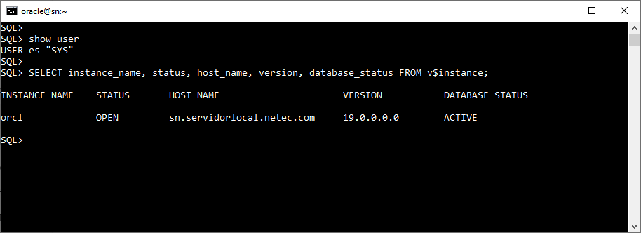

# **Práctica 3.2 Conexión a la base de datos con SQL*Plus**

## **Objetivos**

* Reconocer la relación entre el entorno del sistema operativo y la instancia de Oracle.
* Utilizar el comando `oraenv` para configurar las variables de entorno requeridas.
* Verificar el estado de la base de datos y la instancia activa desde SQL*Plus.
* Consultar vistas dinámicas (`v$instance`, `v$datafile`, `v$controlfile`) para identificar parámetros clave del entorno Oracle.
* Familiarizarse con los comandos internos de SQL*Plus como `SHOW SGA` y `SHOW USER`.

<br/><br/>

## **Duración estimada**

**20 – 25 minutos**

<br/><br/>

## **Tabla de ayuda**

| Comando o vista   | Descripción breve                                          | Ejemplo / Uso                                         |        |           |
| ----------------- | ---------------------------------------------------------- | ----------------------------------------------------- | ------ | --------- |
| `id`              | Muestra el usuario actual del sistema                      | `$ id`                                                |        |           |
| `. oraenv`        | Activa las variables de entorno de Oracle                  | `$ . oraenv`                                          |        |           |
| `env              | grep ORA`                                                  | Verifica variables de entorno relacionadas con Oracle | `$ env | grep ORA` |
| `sqlplus`         | Cliente de línea de comandos para Oracle Database          | `$ sqlplus / as sysdba`                               |        |           |
| `SHOW SGA`        | Muestra el tamaño de las áreas de memoria SGA              | `SQL> SHOW SGA;`                                      |        |           |
| `SHOW USER`       | Indica el usuario actual en SQL*Plus                       | `SQL> SHOW USER;`                                     |        |           |
| `DESC v$instance` | Describe las columnas de la vista dinámica de la instancia | `SQL> DESC v$instance;`                               |        |           |
| `SELECT`          | Consulta información de vistas del diccionario             | `SQL> SELECT instance_name, status FROM v$instance;`  |        |           |


<br/><br/>

## **Instrucciones**

### **Tarea 1. Verificación del usuario del sistema**

1. Abre una terminal en tu entorno Linux.
2. Verifica el usuario actual y sus grupos asociados:

   ```bash
   $ id
   ```
3. Asegúrate de estar autenticado como un usuario con privilegios para acceder a Oracle (por ejemplo, `oracle`).

<br/><br/>

### **Tarea 2. Configuración del entorno Oracle**

1. Actualiza las variables de entorno necesarias para la conexión:

   ```bash
   $ . oraenv
   ```
2. Cuando el sistema solicite el nombre de la base de datos, escribe:

   ```
   orcl
   ```
3. Comprueba las variables relacionadas con Oracle:

   ```bash
   $ env | grep ORA
   ```

<br/><br/>

### **Tarea 3. Conexión inicial a SQL*Plus**

1. Inicia sesión con SQL*Plus como administrador del sistema:

   ```bash
   $ sqlplus / as sysdba
   ```
2. Una vez dentro, verifica los siguientes puntos:

   * **Estado de la base:**

     ```sql
     SQL> SELECT instance_name, status FROM v$instance;
     ```
   * **Tamaño de la memoria SGA:**

     ```sql
     SQL> SHOW SGA;
     ```
   * **Usuario conectado:**

     ```sql
     SQL> SHOW USER;
     ```
   * **Descripción de la vista de instancia:**

     ```sql
     SQL> DESC v$instance;
     ```

<br/><br/>

### **Tarea 4. Exploración adicional**

1. Ejecuta nuevamente la consulta de instancia, esta vez agregando más columnas:

   ```sql
   SQL> SELECT instance_name, status, database_status, version FROM v$instance;
   ```
2. Consulta los nombres de los **archivos de datos** asociados:

   ```sql
   SQL> SELECT name FROM v$datafile;
   ```
3. Consulta los nombres de los **archivos de control**:

   ```sql
   SQL> SELECT name FROM v$controlfile;
   ```

<br/><br/>

### **Tarea 5. Desafío**

Ejecuta una sola consulta SQL que muestre **la instancia**, **el estado de la base de datos**, **el host donde corre Oracle** y **la versión de la instancia**.
*(Usa una combinación adecuada de columnas desde `v$instance` o una subconsulta si lo consideras necesario).*

<br/><br/>

## **Resultado Esperado**

* El participante logra conectarse exitosamente a la base de datos usando SQL*Plus.
* Se muestra la información correcta de la instancia (`instance_name`, `status`, `database_status`, `version`).
* Se listan los archivos de control y de datos del entorno Oracle.
* En la terminal se observa una salida similar a:




