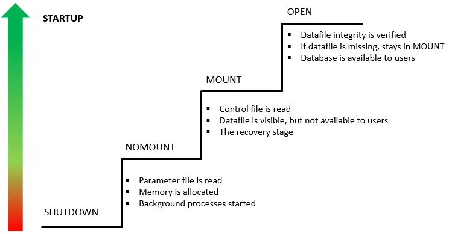
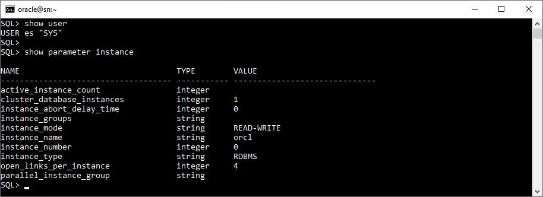

# **Práctica 3.3 Inicio y Cierre de Bases de Datos**


## **Objetivos**

* Identificar los distintos estados de una base de datos Oracle (MOUNT, OPEN, NOMOUNT).
* Aplicar los comandos `STARTUP` y `SHUTDOWN` en sus diferentes modalidades.
* Comprender el uso del comando `ALTER SYSTEM REGISTER` para registrar la instancia en el Listener.
* Verificar el tipo de instancia y su estado operativo mediante vistas dinámicas (`v$instance`).
* Dominar las operaciones básicas de administración de base de datos desde SQL*Plus.

<br/><br/>

## **Duración estimada**

**25 – 30 minutos**

<br/><br/>

## **Tabla de ayuda**

| Comando / Vista                                                 | Descripción                                                    | Ejemplo / Uso                                                         |
| --------------------------------------------------------------- | -------------------------------------------------------------- | --------------------------------------------------------------------- |
| `SQL> HELP SHUTDOWN`                                            | Muestra ayuda sobre las opciones de cierre                     | `SQL> HELP SHUTDOWN;`                                                 |
| `SHUTDOWN IMMEDIATE`                                            | Cierra la base de datos liberando usuarios y guardando cambios | `SQL> SHUTDOWN IMMEDIATE;`                                            |
| `STARTUP`                                                       | Inicia la base de datos Oracle (por defecto hasta modo OPEN)   | `SQL> STARTUP;`                                                       |
| `ALTER SYSTEM REGISTER`                                         | Registra la instancia en el Listener                           | `SQL> ALTER SYSTEM REGISTER;`                                         |
| `SELECT instance_name, status, database_status FROM v$instance` | Verifica el estado actual de la instancia                      | `SQL> SELECT instance_name, status, database_status FROM v$instance;` |
| `SHOW PARAMETER INSTANCE_TYPE`                                  | Muestra el tipo de instancia (ej. RDBMS)                       | `SQL> SHOW PARAMETER INSTANCE_TYPE;`                                  |

<br/><br/>

## **Objetivo visual**

El siguiente diagrama representa el ciclo de vida de una base de datos Oracle, mostrando las transiciones entre los estados **NOMOUNT**, **MOUNT** y **OPEN**, junto con los comandos asociados a cada etapa del proceso de inicio y cierre.



<br/><br/>

## **Instrucciones**

### **Tarea 1. Conexión inicial**

1. Abre una terminal y conéctate como administrador del sistema Oracle:

   ```bash
   $ sqlplus / as sysdba
   ```

2. Verifica el estado de la base de datos:

   ```sql
   SQL> SELECT instance_name, status, database_status FROM v$instance;
   ```

<br/><br/>

### **Tarea 2. Exploración de comandos de cierre**

1. Solicita ayuda sobre el comando de cierre:

   ```sql
   SQL> HELP SHUTDOWN;
   ```
2. Identifica las opciones disponibles: `NORMAL`, `TRANSACTIONAL`, `IMMEDIATE`, `ABORT`.

<br/><br/>

### **Tarea 3. Cierre de la base de datos**

1. Cierra la base de datos de forma inmediata:

   ```sql
   SQL> SHUTDOWN IMMEDIATE;
   ```
2. Espera el mensaje de confirmación:

   ```
   Database closed.
   Database dismounted.
   ORACLE instance shut down.
   ```

<br/><br/>

### **Tarea 4. Apertura de la base de datos**

1. Vuelve a iniciar la base de datos con el comando:

   ```sql
   SQL> STARTUP;
   ```
2. Verifica que el estado de la base de datos sea **OPEN**:

   ```sql
   SQL> SELECT instance_name, status, database_status FROM v$instance;
   ```

<br/><br/>

### **Tarea 5. Registro en el Listener**

1. Registra la instancia manualmente en el Listener:

   ```sql
   SQL> ALTER SYSTEM REGISTER;
   ```
2. Verifica el registro desde la terminal del sistema operativo:

   ```bash
   $ lsnrctl status
   ```

<br/><br/>

### **Tarea 6. Verificación del tipo de instancia**

1. Comprueba el tipo de instancia que utiliza Oracle:

   ```sql
   SQL> SHOW PARAMETER INSTANCE_TYPE;
   ```

   El valor esperado debe ser:

   ```
   instance_type = RDBMS
   ```

<br/><br/>

### **Tarea 7. Desafío**

Diseña una **sola secuencia de comandos SQL** que:

* Cierre la base de datos (modo inmediato),
* La vuelva a abrir,
* Registre la instancia en el Listener,
* Y confirme que el tipo de instancia sea **RDBMS**.

Ejecuta todos los pasos sin salir de SQL*Plus.

<br/><br/>

## **Resultado Esperado**

* El participante logra cerrar y abrir correctamente la base de datos.
* El estado final de la base muestra:

  ```
  STATUS           DATABASE_STATUS
  OPEN             ACTIVE
  ```
* El Listener refleja la instancia registrada.
* El parámetro `INSTANCE_TYPE` confirma que el tipo es **RDBMS**.


Comandos empleados:

```sql
SHUTDOWN IMMEDIATE; 
STARTUP; 
ALTER SYSTEM REGISTER; 
SHOW PARAMETER INSTANCE_TYPE;
```




