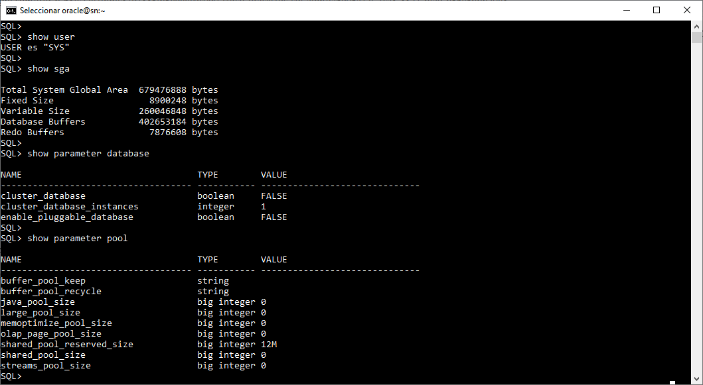
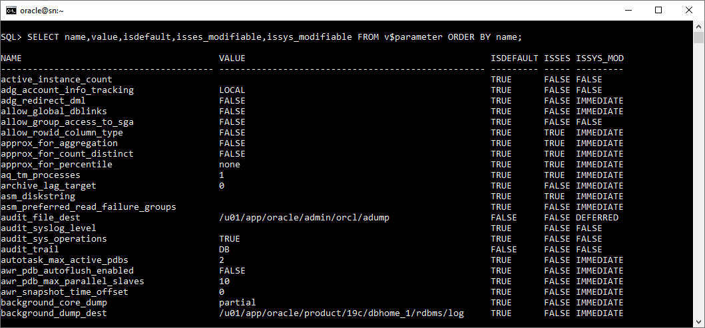

# **Práctica 3.4 Visualización de Parámetros de Inicialización**


## **Objetivos**

* Conectarte como administrador en **SQL*Plus** y preparar un **reporte con SPOOL**.
* Usar `SHOW PARAMETER` y vistas dinámicas (`V$PARAMETER`, `V$SPPARAMETER`, `V$INSTANCE`, `V$RECOVERY_FILE_DEST`, `V$SGA_DYNAMIC_COMPONENTS`).
* Determinar **tipo de instancia**, **SPFILE** en uso, **tamaño de FRA**, **job queue**, **SGA_TARGET vs SGA_MAX_SIZE**, y tamaños de **SHARED_POOL** y **DB_CACHE**.
* Distinguir **valores por defecto** vs **especificados**, y si los parámetros son **modificables** a nivel de sesión/sistema.
* Generar un listado completo de parámetros filtrable por nombre.

<br/><br/>

## **Duración estimada**

40–55 minutos

<br/><br/>

## **Tabla de ayuda**

| Concepto                 | Comando/Vista                                                                                           | Filtro útil                 | Punto clave                                                                                          |
| ------------------------ | ------------------------------------------------------------------------------------------------------- | --------------------------- | ---------------------------------------------------------------------------------------------------- |
| Tipo de instancia        | `SHOW PARAMETER instance_type` ; `SELECT instance_type FROM v$instance;`                                | `instance_type`             | Indica si es `RDBMS`, `RAC`, etc.                                                                    |
| Archivo de inicio        | `SHOW PARAMETER spfile` ; `SELECT * FROM v$spparameter WHERE isspecified='TRUE';`                       | `spfile`                    | Ruta del **SPFILE** si fue usado; `v$spparameter` muestra el origen.                                 |
| FRA (destino/tamaño/uso) | `SHOW PARAMETER db_recovery_file_dest[_size]` ; `SELECT * FROM v$recovery_file_dest;`                   | `db_recovery_file_dest`     | Verifica tamaño configurado y uso actual.                                                            |
| Job queue                | `SHOW PARAMETER job_queue_processes`                                                                    | `job`                       | Límite de procesos de jobs en background.                                                            |
| Límite SGA               | `SHOW PARAMETER sga_max_size` ; `SHOW PARAMETER sga_target` ; `SELECT * FROM v$sga_dynamic_components;` | `sga`                       | `SGA_MAX_SIZE` es el tope estricto para ajuste de `SGA_TARGET`.                                      |
| Pools (SGA)              | `SHOW PARAMETER shared_pool_size` ; `SHOW PARAMETER db_cache_size`                                      | `shared` / `cache`          | Si `SGA_TARGET/MEMORY_TARGET` gestionan memoria, algunos tamaños pueden aparecer **0** (autoajuste). |
| Listado completo         | `SELECT name,value,isdefault,isses_modifiable,issys_modifiable FROM v$parameter ORDER BY name;`         | `WHERE name LIKE '%texto%'` | Útil para filtrar y reconocer modificabilidad y origen.                                              |

<br/><br/>

## **Objetivo visual**

El diagrama ilustra la relación entre **SGA_TARGET** (memoria autoajustada), su tope **SGA_MAX_SIZE** y componentes como **Shared Pool** y **Database Buffer Cache**.


<br/><br/>


## **Instrucciones**

### **Tarea 1. Conexión y preparación del reporte**

1. Abre terminal y entra a **SQL*Plus** como administrador de la instancia **orcl**:

   ```
   sqlplus / as sysdba
   ```
2. Mejora legibilidad y comienza un **spool**:

   ```
   SET LINESIZE 200 PAGESIZE 100 TRIMSPOOL ON
   COLUMN name FORMAT A40
   COLUMN value FORMAT A80
   SPOOL practica_3_4_parametros.lst
   ```

<br/><br/>

### **Tarea 2. Tipo de instancia**

1. Obtén el tipo de instancia:

   ```
   SHOW PARAMETER instance_type
   ```
2. Corrobora desde la vista de instancia:

   ```
   SELECT instance_name, instance_role, instance_type FROM v$instance;
   ```

<br/><br/>

### **Tarea 3. Archivo de inicio (SPFILE/PFILE)**

1. Verifica con qué **SPFILE** inició:

   ```
   SHOW PARAMETER spfile
   ```
2. Lista parámetros realmente **especificados** en el SPFILE:

   ```
   SELECT name, value FROM v$spparameter WHERE isspecified = 'TRUE' ORDER BY name;
   ```

<br/><br/>

### **Tarea 4. Área de Recuperación (FRA)**

1. Revisa destino y **tamaño configurado**:

   ```
   SHOW PARAMETER db_recovery_file_dest
   SHOW PARAMETER db_recovery_file_dest_size
   ```
2. Confirma **uso y espacio**:

   ```
   SELECT name, space_limit, space_used, number_of_files FROM v$recovery_file_dest;
   ```

<br/><br/>

### **Tarea 5. Cola de procesos de trabajo (Job Queue)**

1. Consulta el valor actual:

   ```
   SHOW PARAMETER job_queue_processes
   ```

<br/><br/>

### **Tarea 6. Límite estricto de ajuste SGA**

1. Revisa `SGA_MAX_SIZE` (tope) y `SGA_TARGET` (autoajuste):

   ```
   SHOW PARAMETER sga_max_size
   SHOW PARAMETER sga_target
   ```
2. Observa componentes dinámicos:

   ```
   SELECT component, current_size, min_size, max_size
   FROM v$sga_dynamic_components
   WHERE current_size > 0
   ORDER BY component;
   ```

<br/><br/>

### **Tarea 7. Tamaños de Shared Pool y Buffer Cache**

1. Consulta **Shared Pool** y **DB Cache**:

   ```
   SHOW PARAMETER shared_pool_size
   SHOW PARAMETER db_cache_size
   ```
2. (Opcional, para contexto) Otros pools:

   ```
   SHOW PARAMETER large_pool_size
   SHOW PARAMETER java_pool_size
   ```
3. **Interpreta**: si algún tamaño aparece **0** con `SGA_TARGET` activo, significa **autoajuste** (no que el pool no exista).

<br/><br/>

### **Tarea 8. Listado de todos los parámetros**

1. Lista completa con atributos clave:

   ```
   SELECT name,
          value,
          isdefault,
          isses_modifiable,
          issys_modifiable
   FROM v$parameter
   ORDER BY name;
   ```
2. Ejemplos de filtro:

   ```
   SELECT name, value FROM v$parameter WHERE name LIKE '%undo%';
   SELECT name, value FROM v$parameter WHERE name LIKE 'db_%' ORDER BY name;
   ```

<br/><br/>

### **Tarea 9. Desafío**

Produce **un solo script** que:

1. Confirme si la instancia **usó SPFILE** o **PFILE** al arrancar y muestre **la ruta** si aplica.
2. Muestre el **límite estricto** para el ajuste dinámico de SGA y el **valor actual objetivo**.
3. Justifique por qué `shared_pool_size` o `db_cache_size` podrían verse en **0** y cómo evidenciar el **tamaño efectivo** de los componentes.
4. Genere un **reporte único** (`practica_3_4_reporte.lst`) con todas las salidas.

**Pauta mínima del script (en una línea por comando, sin comentarios):**

```
SET LINESIZE 200 PAGESIZE 100 TRIMSPOOL ON; 
SPOOL practica_3_4_reporte.lst; 
SHOW PARAMETER spfile; 
SELECT DECODE(value, NULL, 'PFILE/DEFAULT', 'SPFILE') origen FROM v$parameter WHERE name='spfile'; 
SHOW PARAMETER sga_max_size; SHOW PARAMETER sga_target; 
SHOW PARAMETER shared_pool_size; SHOW PARAMETER db_cache_size; 
ELECT component,current_size FROM v$sga_dynamic_components WHERE current_size>0 ORDER BY component; 
SPOOL OFF;
```
<br/><br/>

### **Tarea 10. Cierre del reporte**

1. Finaliza el **spool** y sal de SQL*Plus:

   ```
   SPOOL OFF
   EXIT
   ```

<br/><br/>

## **Resultado Esperado**

* **Tipo de instancia**

  ```
  show parameter instance_type
  ```

* **SPFILE en uso (ruta)**

  ```
  show parameter spfile
  ```

* **Tamaño de FRA**

  ```
  show parameter db_recovery_file_dest_size
  ```

* **Cola de procesos de trabajo (jobs)**

  ```
  show parameter job
  ```

* **Límite estricto de ajuste SGA**

  ```
  show parameter sga_max_size
  ```

* **Valores consultados de pools y caché**

  ```
  show parameter shared_pool_size
  show parameter db_cache_size
  ```

* **Listado de todos los parámetros**

  ```
  SELECT name,value,isdefault,isses_modifiable,issys_modifiable FROM v$parameter ORDER BY name;
  ```

