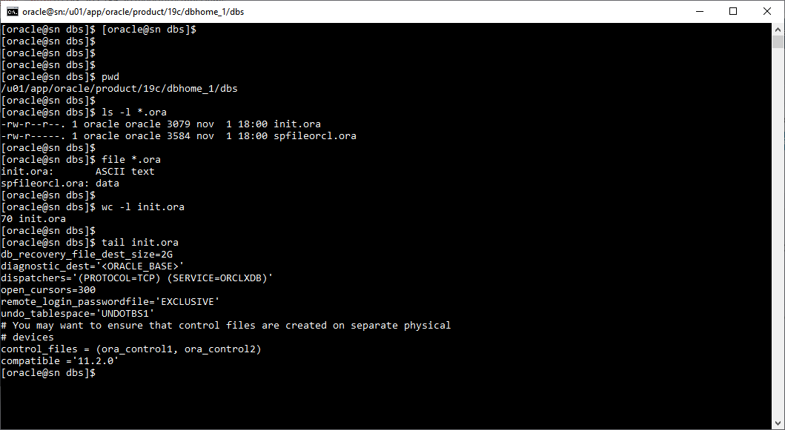

# **Práctica 3.5 Copia de SPFILE**

<br/><br/>

## **Objetivos**

* Identificar la ubicación y estructura de los archivos de parámetros en Oracle Database.
* Generar copias del SPFILE utilizando comandos SQL*Plus.
* Verificar la existencia y tipo de los archivos generados en el sistema operativo.
* Modificar parámetros a nivel de memoria y validar su persistencia al reiniciar la instancia.
* Iniciar la base de datos utilizando un archivo de parámetros alternativo.

<br/><br/>

## **Duración estimada**

30 minutos

<br/><br/>

## **Tabla de ayuda**

| Comando / Concepto                               | Descripción                                                            | Ejemplo / Observación                             |
| ------------------------------------------------ | ---------------------------------------------------------------------- | ------------------------------------------------- |
| `SPFILE`                                         | Archivo binario que contiene los parámetros de inicio de la instancia. | `$ORACLE_HOME/dbs/spfile<SID>.ora`                |
| `PFILE`                                          | Archivo de texto plano con parámetros de inicialización.               | `$ORACLE_HOME/dbs/init<SID>.ora`                  |
| `CREATE PFILE FROM SPFILE;`                      | Crea una copia legible del SPFILE.                                     | Genera `init<SID>.ora`                            |
| `CREATE PFILE='nombre.ora' FROM SPFILE;`         | Crea una copia personalizada del SPFILE.                               | `init=orclbackup.ora`                             |
| `SHOW PARAMETER`                                 | Muestra el valor de parámetros de inicialización.                      | `SHOW PARAMETER spfile`                           |
| `ALTER SYSTEM SET parametro=valor SCOPE=MEMORY;` | Modifica el parámetro temporalmente (no se guarda en SPFILE).          | `ALTER SYSTEM SET open_cursors=500 SCOPE=MEMORY;` |
| `$ORACLE_HOME/dbs`                               | Carpeta donde residen los archivos de parámetros y contraseñas.        | Acceso desde SO: `ls -l $ORACLE_HOME/dbs/*.ora`   |

<br/><br/>

## **Objetivo visual**

El siguiente diagrama ilustra la relación entre los archivos de parámetros en Oracle:

<br/> <br/>


<br/> <br/>

> El **SPFILE** es leído por Oracle al iniciar la instancia; el **PFILE** puede generarse a partir de él y permite editar manualmente parámetros en texto plano.

<br/><br/>

## **Instrucciones**

### **Tarea 1. Acceso al entorno**

1. Conéctate a la instancia **orcl** usando SQL*Plus con privilegios de administrador:

   ```bash
   $ sqlplus / as sysdba
   ```
2. Verifica el estado de la base de datos:

   ```sql
   SQL> SELECT status FROM v$instance;
   ```

<br/><br/>

### **Tarea 2. Crear copias del archivo SPFILE**

1. Crea una copia del SPFILE con el nombre predeterminado:

   ```sql
   SQL> CREATE PFILE FROM SPFILE;
   ```
2. Crea una copia personalizada del SPFILE:

   ```sql
   SQL> CREATE PFILE='orclbackup.ora' FROM SPFILE;
   ```

<br/><br/>

### **Tarea 3. Verificación en el sistema operativo**

1. Desde el sistema operativo, verifica la existencia de los archivos:

   ```bash
   $ ls -l $ORACLE_HOME/dbs/*orcl*.ora
   ```
2. Identifica qué archivos son de texto plano:

   ```bash
   $ file $ORACLE_HOME/dbs/*.ora
   ```
3. Revisa el contenido del archivo de texto asociado a **orcl**:

   ```bash
   $ cat $ORACLE_HOME/dbs/init*.ora
   ```

<br/><br/>

### **Tarea 4. Actualización de parámetros en memoria**

1. En SQL*Plus, modifica un parámetro temporalmente (ejemplo):

   ```sql
   SQL> ALTER SYSTEM SET open_cursors=400 SCOPE=MEMORY;
   ```
2. Verifica el valor actual del parámetro:

   ```sql
   SQL> SHOW PARAMETER open_cursors;
   ```

<br/><br/>

### **Tarea 5. Reinicio con archivo alternativo**

1. Detén la instancia de base de datos:

   ```sql
   SQL> SHUTDOWN IMMEDIATE;
   ```
2. Inicia la base de datos utilizando el archivo **orclbackup.ora**:

   ```sql
   SQL> STARTUP PFILE='$ORACLE_HOME/dbs/orclbackup.ora';
   ```
3. Verifica nuevamente el valor del parámetro modificado.

<br/><br/>

### **Tarea 6. Desafío**

Diseña un procedimiento para crear un **nuevo SPFILE** basado en el archivo **orclbackup.ora**, y úsalo para iniciar la base de datos.

> Pistas: utiliza `CREATE SPFILE FROM PFILE='orclbackup.ora';` y valida que el archivo resultante se encuentre en `$ORACLE_HOME/dbs`.

<br/><br/>

## **Resultado Esperado**

* Se generan correctamente los archivos `init.ora` y `orclbackup.ora` en la ruta `$ORACLE_HOME/dbs/`.
* El participante identifica los archivos de texto frente a los binarios.
* Se demuestra la diferencia entre cambiar parámetros en memoria y persistentes.
* La base de datos se inicia exitosamente usando un PFILE alternativo.


