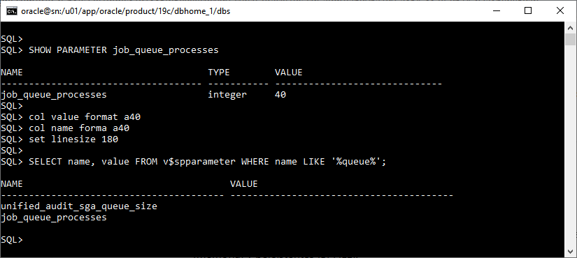

# **Práctica 3.6 – Modificación de Parámetros**


## **Objetivos**

* Identificar los tipos de parámetros de inicialización (estáticos y dinámicos).
* Consultar valores actuales mediante vistas del diccionario de datos.
* Modificar parámetros utilizando el comando `ALTER SYSTEM`.
* Verificar los efectos del cambio en memoria y en el archivo SPFILE.

<br/><br/>

## **Duración estimada**

25 minutos

<br/><br/>

## **Tabla de ayuda**

| Comando / Vista    | Descripción                                                 | Ejemplo                                                            |
| ------------------ | ----------------------------------------------------------- | ------------------------------------------------------------------ |
| `SHOW PARAMETER`   | Muestra parámetros del sistema que coinciden con un patrón. | `SHOW PARAMETER queue`                                             |
| `ALTER SYSTEM SET` | Cambia el valor de un parámetro de inicialización.          | `ALTER SYSTEM SET job_queue_processes=30 SCOPE=BOTH;`              |
| `V$PARAMETER`      | Muestra los valores de parámetros actuales en memoria.      | `SELECT name, value FROM v$parameter WHERE name LIKE '%queue%';`   |
| `V$SPPARAMETER`    | Muestra los valores almacenados en el SPFILE.               | `SELECT name, value FROM v$spparameter WHERE name LIKE '%queue%';` |
| `SCOPE`            | Define el alcance del cambio (`MEMORY`, `SPFILE`, `BOTH`).  | `SCOPE=BOTH`                                                       |

<br/><br/>

## **Objetivo Visual**

El siguiente diagrama muestra la relación entre **PFILE**, **SPFILE** y los valores en **memoria** de la instancia.


>[Source](https://docs.oracle.com/en/database/oracle/oracle-database/12.2/cncpt/oracle-database-instance.html#GUID-2F760754-174C-4A30-800C-8A147561B64C)

<br/><br/>

## **Instrucciones**

### **Tarea 1. Acceso al entorno**

1. Conéctate como administrador de la base de datos:

   ```bash
   sqlplus / as sysdba
   ```
2. Verifica la conexión activa con:

   ```sql
   SHOW USER;
   ```

<br/><br/>

### **Tarea 2. Consultar el valor actual del parámetro**

1. Muestra los parámetros relacionados con procesos en cola:

   ```sql
   SHOW PARAMETER queue
   ```
2. Identifica el valor actual de `job_queue_processes`.

<br/><br/>

### **Tarea 3. Modificar el parámetro**

1. Aumenta el valor del parámetro en **20 unidades más** respecto al valor actual.
   Por ejemplo, si el valor es 10:

   ```sql
   ALTER SYSTEM SET job_queue_processes=30 SCOPE=BOTH;
   ```
2. Verifica el cambio:

   ```sql
   SHOW PARAMETER job_queue_processes
   ```

<br/><br/>

### **Tarea 4. Validar el cambio en el SPFILE**

1. Ejecuta la siguiente consulta para confirmar el valor almacenado:

   ```sql
   SELECT name, value 
   FROM v$spparameter 
   WHERE name LIKE '%queue%';
   ```

2. Verifica que el valor modificado se haya guardado tanto en memoria como en el SPFILE.

<br/><br/>

### **Tarea 5. Reinicio y comprobación (opcional si se usa SPFILE)**

1. Reinicia la instancia:

   ```sql
   SHUTDOWN IMMEDIATE;
   STARTUP;
   ```
2. Repite el comando:

   ```sql
   SHOW PARAMETER job_queue_processes
   ```

   y verifica que el cambio se conserve.

<br/><br/>

### **Tarea 6. Desafío**

Determina qué sucedería si el parámetro modificado fuera **estático** y se intentara cambiar con `SCOPE=MEMORY`.

1. Intenta el cambio.
2. Observa el mensaje de error.
3. Explica en una breve nota la diferencia entre parámetros **estáticos** y **dinámicos**, y cómo se gestionan sus modificaciones en Oracle Database.

<br/><br/>

## **Resultado Esperado**

La siguiente captura muestra la comprobación del parámetro **`JOB_QUEUE_PROCESSES`** en Oracle.
Primero, con `SHOW PARAMETER job_queue_processes`, se confirma que su valor actual es **40**, indicando el número máximo de *job processes* permitidos.
Luego, mediante la consulta a **`V$SPPARAMETER`**, se verifica que este valor también está registrado en el **SPFILE**, lo que significa que el cambio fue persistente (efectivo tanto en memoria como en el archivo de parámetros).





