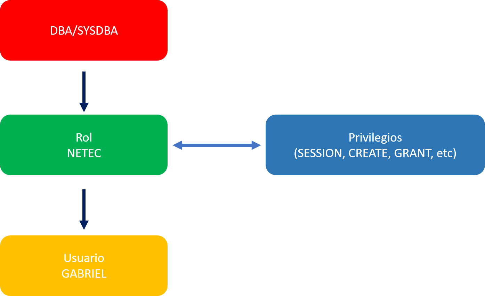

# **Práctica 4.2 Creación y Gestión de Roles**

## **Objetivos**

* Comprender la diferencia entre privilegios del sistema y roles.
* Identificar los usuarios o roles con privilegios para crear nuevos roles.
* Crear un rol personalizado con privilegios adecuados.
* Asignar roles a usuarios y verificar los privilegios heredados.
* Revocar privilegios directos para consolidar la administración mediante roles.

<br/><br/>

## **Duración estimada**

30 minutos

<br/><br/>

## **Tabla de ayuda**

| Concepto / Comando | Descripción                                            | Vista del Diccionario             | Referencia Oficial                                                                                                    |
| ------------------ | ------------------------------------------------------ | --------------------------------- | --------------------------------------------------------------------------------------------------------------------- |
| `CREATE ROLE`      | Crea un rol que agrupa privilegios.                    | `DBA_ROLES`                       | [Docs Oracle 19c – CREATE ROLE](https://docs.oracle.com/en/database/oracle/oracle-database/19/sqlrf/CREATE-ROLE.html) |
| `GRANT`            | Asigna privilegios o roles a usuarios/roles.           | `DBA_SYS_PRIVS`, `ROLE_SYS_PRIVS` | [Docs Oracle – GRANT](https://docs.oracle.com/en/database/oracle/oracle-database/19/sqlrf/GRANT.html)                 |
| `REVOKE`           | Revoca privilegios o roles otorgados.                  | `DBA_TAB_PRIVS`, `DBA_ROLE_PRIVS` | [Docs Oracle – REVOKE](https://docs.oracle.com/en/database/oracle/oracle-database/19/sqlrf/REVOKE.html)               |
| `DBA_SYS_PRIVS`    | Muestra los privilegios del sistema asignados.         | —                                 | [Docs Oracle – DBA_SYS_PRIVS](https://docs.oracle.com/en/database/oracle/oracle-database/19/refrn/DBA_SYS_PRIVS.html) |
| `CREATE SESSION`   | Permite al usuario iniciar sesión en la base de datos. | —                                 | —                                                                                                                     |

<br/><br/>

## **Objetivo visual**

El siguiente diagrama ilustra la relación entre **usuarios**, **roles** y **privilegios** en Oracle:



<br/><br/>

## **Instrucciones**

### **Tarea 1. Conectarse como administrador**

1. Abre una sesión de **SQL*Plus** como **SYSDBA**:

   ```sql
   sqlplus / as sysdba
   ```

2. Verifica qué usuarios o roles tienen el privilegio para crear roles:

   ```sql
   SELECT grantee FROM dba_sys_privs WHERE privilege = 'CREATE ROLE';
   ```

<br/><br/>

### **Tarea 2. Crear un rol personalizado**

1. Crea un rol denominado **NETEC**:

   ```sql
   CREATE ROLE NETEC;
   ```

2. Asigna los siguientes privilegios al rol:

   ```sql
   GRANT CREATE SESSION TO NETEC;
   GRANT CREATE USER TO NETEC;
   GRANT CREATE ROLE TO NETEC;
   ```

<br/><br/>

### **Tarea 3. Asignar el rol a un usuario**

1. Otorga el rol **NETEC** al usuario **GABRIEL**:

   ```sql
   GRANT NETEC TO GABRIEL;
   ```

2. Verifica que el rol haya sido asignado correctamente:

   ```sql
   SELECT * FROM dba_role_privs WHERE grantee = 'GABRIEL';
   ```

<br/><br/>

### **Tarea 4. Revocar privilegios directos**

1. Verifica los privilegios del sistema actualmente otorgados al usuario **GABRIEL**:

   ```sql
   SELECT * FROM dba_sys_privs WHERE grantee = 'GABRIEL';
   ```

2. Revoca los privilegios directos para delegarlos a través del rol:

   ```sql
   REVOKE CREATE SESSION FROM GABRIEL;
   REVOKE CREATE USER FROM GABRIEL;
   ```

<br/><br/>

### **Tarea 5. Validar la gestión mediante roles**

1. Conéctate como **GABRIEL** y valida que los privilegios heredados provienen del rol **NETEC**:

   ```sql
   sqlplus gabriel/tu_password
   SHOW USER;
   SHOW ROLE;
   ```

<br/><br/>

### **Tarea 6. Desafío**

Diseña un nuevo rol llamado **OPERACIONES** que contenga privilegios suficientes para:

* Crear tablas y vistas.
* Conectarse a la base de datos.
* Ser asignado al usuario **IAN**.

Valida mediante consultas a `DBA_ROLE_PRIVS` y `DBA_SYS_PRIVS` que **IAN** posee dichos privilegios solo a través del rol **OPERACIONES**, y no de manera directa.

<br/><br/>

## **Resultado Esperado**

* El rol **NETEC** se ha creado correctamente y contiene los privilegios `CREATE SESSION`, `CREATE USER` y `CREATE ROLE`.
* El usuario **GABRIEL** puede iniciar sesión y administrar usuarios únicamente a través del rol asignado.
* Se evidencia la buena práctica de administrar privilegios de forma centralizada mediante **roles**.
* El participante comprende la diferencia entre **privilegios directos** y **roles otorgados**.

