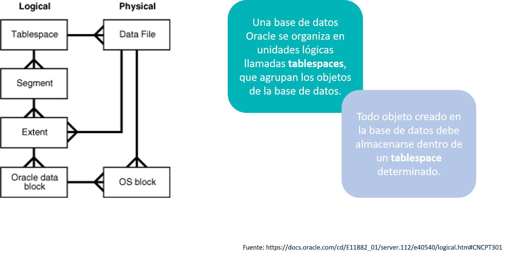

# **Práctica 5.1 Visualización del Espacio de Almacenamiento**

<br/><br/>

## **Objetivos**

1. Identificar los **tablespaces** que conforman la base de datos Oracle.
2. Localizar los **archivos físicos** del sistema operativo asociados a cada tablespace.
3. Calcular el **tamaño en MB** de cada datafile.
4. Determinar el **tamaño del bloque de datos** configurado en la base de datos.
5. Ubicar el **tablespace que contiene la tabla HR.EMPLOYEES**.
6. Obtener el **tamaño de la tabla HR.EMPLOYEES** y su número de **extents** actuales y máximos.

<br/><br/>

## **Duración estimada**

**25 minutos**

<br/><br/>


## **Tabla de ayuda**

| Concepto           | Descripción                                      | Vista o Comando                | Ejemplo de consulta                                        |
| ------------------ | ------------------------------------------------ | ------------------------------ | ---------------------------------------------------------- |
| Tablespace         | Unidad lógica de almacenamiento en Oracle        | `DBA_TABLESPACES`              | `SELECT tablespace_name FROM dba_tablespaces;`             |
| Datafile           | Archivo físico en el SO asociado a un tablespace | `DBA_DATA_FILES`               | `SELECT file_name, bytes FROM dba_data_files;`             |
| Tamaño del bloque  | Unidad mínima de lectura/escritura               | `SHOW PARAMETER db_block_size` | `show parameter db_block_size;`                            |
| Tabla HR.EMPLOYEES | Tabla de ejemplo del esquema HR                  | `DBA_TABLES`                   | `SELECT tablespace_name FROM dba_tables WHERE owner='HR';` |
| Extents            | Segmentos de espacio asignados a una tabla       | `DBA_TABLES` o `ALL_TABLES`    | `SELECT blocks, num_freelist_blocks FROM all_tables;`      |

<br/><br/>


## **Objetivo visual**

El siguiente diagrama representa la relación entre las estructuras lógicas y físicas de almacenamiento en Oracle Database:



<br/><br/>

## **Instrucciones**

### **Tarea 1. Conexión al entorno de administración**

1. Abre una terminal y conéctate como administrador:

   ```bash
   $ sqlplus / as sysdba
   ```
2. Verifica la conexión activa:

   ```sql
   SHOW USER;
   ```

<br/><br/>

### **Tarea 2. Verificación de tablespaces**

1. Muestra los tablespaces disponibles y su modo de administración:

   ```sql
   SELECT tablespace_name, extent_management FROM dba_tablespaces;
   ```

<br/><br/>

### **Tarea 3. Identificación de datafiles**

1. Configura formato de columnas y consulta los datafiles:

   ```sql
   COL archivo FORMAT a40
   COL tablespace FORMAT a20
   SET linesize 120
   SELECT rpad(a.tablespace_name,10) tablespace,
          rpad(a.file_name,40) archivo
   FROM dba_data_files a;
   ```

<br/><br/>

### **Tarea 4. Tamaño de los datafiles**

1. Consulta el tamaño en MB de cada archivo físico:

   ```sql
   SELECT rpad(a.tablespace_name,10) tablespace,
          rpad(a.file_name,40) archivo,
          TO_CHAR(a.bytes/1024/1024,'999,999.99') AS MB
   FROM dba_data_files a;
   ```

<br/><br/>

### **Tarea 5. Tamaño del bloque**

1. Verifica el tamaño de bloque de la base de datos:

   ```sql
   SHOW PARAMETER db_block_size;
   ```

<br/><br/>

### **Tarea 6. Tablespace de la tabla HR.EMPLOYEES**

1. Determina en qué tablespace se almacena la tabla:

   ```sql
   SELECT tablespace_name
   FROM dba_tables
   WHERE owner='HR' AND table_name='EMPLOYEES';
   ```

<br/><br/>

### **Tarea 7. Tamaño de la tabla HR.EMPLOYEES**

1. Consulta el número de bloques y el tamaño total estimado:

   ```sql
   SELECT blocks, empty_blocks, num_freelist_blocks,
          blocks * 8192 AS "Size(Bytes)"
   FROM all_tables
   WHERE owner='HR' AND table_name='EMPLOYEES';
   ```

<br/><br/>

### **Tarea 8. Extents usados por la tabla HR.EMPLOYEES**

1. Verifica el número de **extents actuales y máximos** asignados:

   ```sql
   SELECT table_name, extents, max_extents
   FROM dba_tables
   WHERE owner='HR' AND table_name='EMPLOYEES';
   ```

<br/><br/>

### **Tarea 9. Desafío**

Diseña una consulta que muestre, para todas las tablas del esquema `HR`, el nombre de la tabla, el tablespace asociado, el número de extents utilizados y el tamaño total en MB, **ordenado por tamaño descendente**.

<br/><br/>

## **Resultado Esperado**

* Lista de tablespaces y sus modos de administración.
* Relación entre tablespaces y datafiles con tamaños en MB.
* Tamaño del bloque de datos.
* Identificación del tablespace donde reside `HR.EMPLOYEES`.
* Cálculo del tamaño de la tabla y su número de extents.
* Consulta personalizada que consolide toda la información en el desafío.

 
