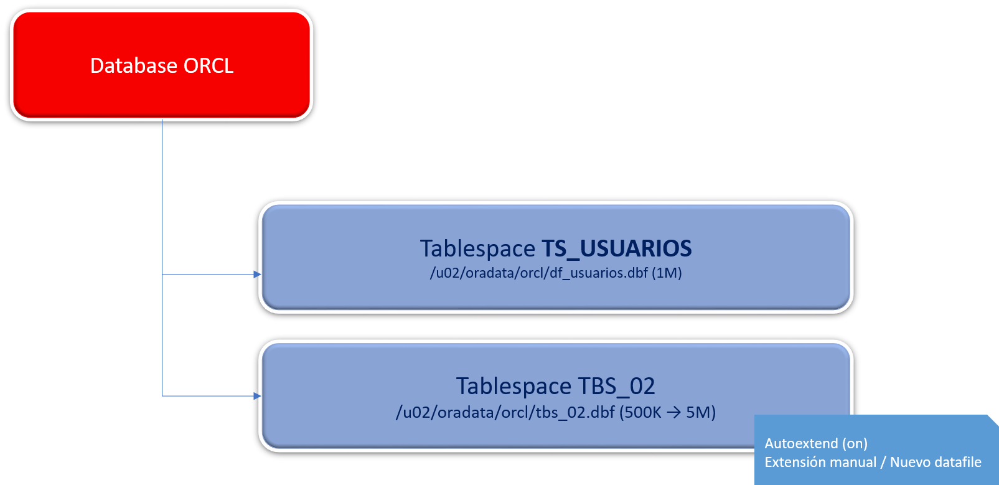
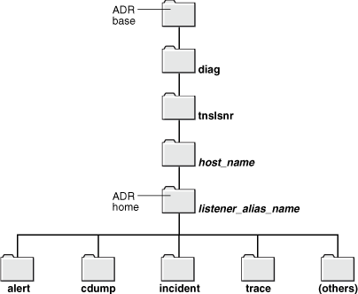

# **Práctica 5.2 Creación y Gestión de Tablespaces en Oracle 19c**


## **Objetivos**

* Crear tablespaces en Oracle con diferentes tipos de administración de extensiones.
* Analizar errores comunes al crear tablespaces y comprender sus causas.
* Verificar la información de los tablespaces creados mediante vistas del diccionario.
* Simular el llenado de espacio y aplicar soluciones mediante adición o extensión de datafiles.
* Comprender las ventajas del autoextend y de la gestión local de extents.

<br/><br/>

## **Duración estimada**

45 minutos

<br/><br/>


## **Tabla de ayuda**

| Concepto / Comando        | Descripción                                                          | Referencia oficial                                                                                                                         |
| ------------------------- | -------------------------------------------------------------------- | ------------------------------------------------------------------------------------------------------------------------------------------ |
| `CREATE TABLESPACE`       | Crea un nuevo tablespace en la base de datos                         | [Oracle Docs – CREATE TABLESPACE](https://docs.oracle.com/en/database/oracle/oracle-database/19/sqlrf/CREATE-TABLESPACE.html)              |
| `EXTENT MANAGEMENT LOCAL` | Administra las extensiones de manera local dentro del tablespace     | [Oracle Docs – Locally Managed Tablespaces](https://docs.oracle.com/en/database/oracle/oracle-database/19/admin/managing-tablespaces.html) |
| `OERR`                    | Muestra información de códigos de error ORA-xxxx                     | `oerr ora <código>`                                                                                                                        |
| `DBA_TABLESPACES`         | Vista del diccionario que muestra las propiedades de los tablespaces | [DBA_TABLESPACES](https://docs.oracle.com/en/database/oracle/oracle-database/19/refrn/DBA_TABLESPACES.html)                                |
| `ALTER TABLESPACE`        | Permite modificar el tamaño o agregar datafiles                      | [ALTER TABLESPACE](https://docs.oracle.com/en/database/oracle/oracle-database/19/sqlrf/ALTER-TABLESPACE.html)                              |
| `ADRCI`                   | Herramienta para inspeccionar alertas y diagnósticos                 | [ADRCI Utility](https://docs.oracle.com/en/database/oracle/oracle-database/19/dbrm/using-adrci.html)                                       |

<br/><br/>


## **Objetivo visual**

El siguiente diagrama representa la relación entre los **tablespaces**, sus **datafiles físicos**, y las **alertas** generadas cuando se alcanza el límite de espacio.



<br/><br/>


## **Instrucciones**

### **Tarea 1. Preparación del entorno**

1. Inicia sesión como **root** en la terminal.
2. Crea el directorio donde se almacenarán los datafiles:

   ```bash
   # mkdir -p /u02/oradata/orcl
   # chown -R oracle:dba /u02/oradata/orcl
   ```
3. Inicia sesión en Oracle como DBA:

   ```bash
   $ sqlplus / as sysdba
   ```

<br/><br/>


### **Tarea 2. Creación de un tablespace gestionado por diccionario**

1. Intenta crear un tablespace manejado por diccionario:

   ```sql
   SQL> CREATE TABLESPACE ts_usuarios 
        DATAFILE '/u02/oradata/orcl/df_usuarios.dbf' 
        SIZE 1M REUSE 
        EXTENT MANAGEMENT DICTIONARY;
   ```
2. Cuando aparezca el error **ORA-12913**, investígalo:

   ```bash
   $ oerr ora 12913
   ```
3. Describe brevemente la causa del error.

<br/><br/>


### **Tarea 3. Creación de un tablespace gestionado localmente**

1. Crea nuevamente el tablespace con administración local:

   ```sql
   SQL> CREATE TABLESPACE ts_usuarios 
        DATAFILE '/u02/oradata/orcl/df_usuarios.dbf' 
        SIZE 1M REUSE 
        EXTENT MANAGEMENT LOCAL UNIFORM SIZE 128K;
   ```
2. Verifica la creación:

   ```sql
   SQL> SELECT name FROM v$tablespace;
   SQL> SELECT tablespace_name, block_size, initial_extent, max_extents, max_size 
        FROM dba_tablespaces;
   ```

<br/><br/>


### **Tarea 4. Creación de un segundo tablespace**

1. Crea un tablespace con **autoextensión limitada**:

   ```sql
   SQL> CREATE TABLESPACE tbs_02 
        DATAFILE '/u02/oradata/orcl/tbs_02.dbf' 
        SIZE 500K REUSE 
        AUTOEXTEND ON NEXT 500K MAXSIZE 5M;
   ```

<br/><br/>


### **Tarea 5. Ejecución de scripts de prueba**

1. Verifica que no exista la tabla **TEMPO**:

   ```sql
   SQL> SELECT table_name FROM dba_tables WHERE table_name = 'TEMPO';
   ```
2. Si existe, elimínala:

   ```sql
   SQL> DROP TABLE TEMPO;
   ```
3. Ejecuta los scripts desde las siguientes cuentas:

   ```bash
   $ cd $HOME/codes/05_almacenamiento
   $ sqlplus system/Oracle1 @p02_espacio.sql
   $ sqlplus hr/Oracle1 @p02.sql
   ```
4. Puedes tomar el código de p02_espacio.sql del bloque siguiente:

   ```sql
   --
   -- Oracle 19c SQL & Admin
   -- p02_espacio.sql
   -- Espacio usado por los tablespaces
   --
   col "Tablespace" for a22
   col "Used MB" for 99,999,999
   col "Free MB" for 99,999,999
   col "Total MB" for 99,999,999

   select df.tablespace_name "Tablespace", totalusedspace "Used MB", (df.totalspace - tu.totalusedspace) "Free MB",
   df.totalspace "Total MB", round(100 * ( (df.totalspace - tu.totalusedspace)/ df.totalspace)) "Pct. Free" from
   (select tablespace_name, round(sum(bytes) / 1048576) TotalSpace from dba_data_files group by tablespace_name) df, (select round(sum(bytes)/(1024*1024)) totalusedspace, tablespace_name from dba_segments group by tablespace_name) tu where df.tablespace_name = tu.tablespace_name ;
   quit
   ```


<br/><br/>


### **Tarea 6. Verificación del llenado y alertas**

0. Toma el código de p02.sql del siguiente bloque

   ```sql
   --
   --  Curso Oracle 19c SQL & ADM
   --
   -- DROP TABLE TEMPO;

   SET echo ON
   
   CREATE TABLE TEMPO
   (col CHAR(1000)
   ) TABLESPACE tbs_02;

   INSERT INTO TEMPO VALUES ('netec');
   INSERT INTO TEMPO SELECT * FROM TEMPO;
   INSERT INTO TEMPO SELECT * FROM TEMPO;
   INSERT INTO TEMPO SELECT * FROM TEMPO;
   INSERT INTO TEMPO SELECT * FROM TEMPO;
   INSERT INTO TEMPO SELECT * FROM TEMPO;
   INSERT INTO TEMPO SELECT * FROM TEMPO;
   INSERT INTO TEMPO SELECT * FROM TEMPO;
   INSERT INTO TEMPO SELECT * FROM TEMPO;
   INSERT INTO TEMPO SELECT * FROM TEMPO;
   INSERT INTO TEMPO SELECT * FROM TEMPO;
   INSERT INTO TEMPO SELECT * FROM TEMPO;
   INSERT INTO TEMPO SELECT * FROM TEMPO;
   INSERT INTO TEMPO SELECT * FROM TEMPO;
   INSERT INTO TEMPO SELECT * FROM TEMPO;
   COMMIT;
   quit
   ```

1. Repite la ejecución del script `p02.sql` hasta recibir el error:

   ```
   ORA-01653: Unable to extend table HR:TEMPO
   ```

2. Abre la utilidad de diagnóstico para visualizar las alertas:

   ```bash
   $ adrci
   ADRCI> show alert
   ```

<br/><br/>


### **Tarea 7. Solución al error de espacio**

1. Agrega un nuevo datafile de 150 MB:

   ```sql
   SQL> ALTER TABLESPACE tbs_02 
        ADD DATAFILE '/u02/oradata/orcl/new_datafile.dbf' SIZE 150M;
   ```

2. Vuelve a insertar datos y verifica que el error haya desaparecido.

3. Alternativamente, amplía un datafile existente:

   ```sql
   SQL> ALTER DATABASE DATAFILE '/u02/oradata/orcl/tbs_02.dbf' RESIZE 150M;
   ```
   
4. Reflexiona: ¿Qué ventaja ofrece el parámetro `AUTOEXTEND ON` para prevenir estos errores?

<br/><br/>


### **Tarea 8. Desafío**

Explica y demuestra **dos formas distintas** de gestionar el crecimiento automático del espacio en los tablespaces, asegurando que **no se interrumpan las operaciones de inserción**.
Incluye las sentencias SQL que usarías en cada caso y justifica su elección.

<br/><br/>


## **Resultado Esperado**

Al finalizar esta práctica, el participante habrá creado y gestionado correctamente tablespaces en Oracle, interpretado errores del sistema (ORA-12913 y ORA-01653), y aplicado técnicas de ampliación de espacio (manual y automática).


