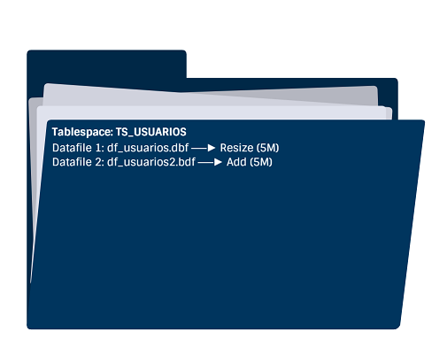

# **Práctica 5.3 Extensión del Espacio de la Base de Datos**


## **Objetivos**

1. Identificar los datafiles y su relación con los tablespaces.
2. Consultar el espacio libre y total disponible en cada tablespace.
3. Redimensionar un datafile existente para aumentar su tamaño.
4. Agregar un nuevo archivo de datos al tablespace.
5. Verificar los cambios realizados en la estructura de almacenamiento.

<br/><br/>

## **Duración estimada**

**25 minutos**

<br/><br/>

## **Tabla de ayuda**

| Concepto          | Descripción                                   | Vista/Comando                        | Referencia oficial                                                                                                              |
| ----------------- | --------------------------------------------- | ------------------------------------ | ------------------------------------------------------------------------------------------------------------------------------- |
| **Tablespace**    | Unidad lógica de almacenamiento en Oracle     | `DBA_TABLESPACES`                    | [Oracle Docs – Tablespaces](https://docs.oracle.com/en/database/oracle/oracle-database/19/admin/managing-tablespaces.html)      |
| **Datafile**      | Archivo físico asociado a un tablespace       | `DBA_DATA_FILES`                     | [Managing Datafiles](https://docs.oracle.com/en/database/oracle/oracle-database/19/admin/managing-datafiles-and-tempfiles.html) |
| **Espacio libre** | Bloques de datos disponibles en un tablespace | `DBA_FREE_SPACE`                     | [Free Space Views](https://docs.oracle.com/en/database/oracle/oracle-database/19/admin/managing-data-files-and-temp-files.html)                     |
| **Resize**        | Cambia el tamaño de un datafile               | `ALTER DATABASE DATAFILE ... RESIZE` | SQL Language Reference                                                                                                          |
| **Add Datafile**  | Añade un archivo nuevo al tablespace          | `ALTER TABLESPACE ... ADD DATAFILE`  | SQL Language Reference                                                                                                          |

<br/><br/>

## **Objetivo Visual**

El siguiente esquema muestra cómo un tablespace puede **extenderse** al **redimensionar un datafile existente** o al **agregar uno nuevo**:



<br/><br/>

## **Instrucciones**

### **Tarea 1. Acceso al entorno**

1. Inicia sesión en Oracle como usuario con privilegios de administrador:

   ```bash
   $ sqlplus / as sysdba
   ```

<br/><br/>

### **Tarea 2. Verificación del espacio actual**

1. Lista todos los tablespaces disponibles:

   ```sql
   SQL> SELECT tablespace_name FROM dba_tablespaces;
   ```
2. Consulta el espacio libre en cada tablespace (en MB):

   ```sql
   SQL> SELECT tablespace_name, ROUND(SUM(bytes)/1024/1024,0) AS MB_LIBRES
        FROM dba_free_space
        WHERE tablespace_name NOT LIKE 'TEMP%'
        GROUP BY tablespace_name;
   ```
3. Verifica el espacio total asignado a cada tablespace:

   ```sql
   SQL> SELECT tablespace_name, ROUND(SUM(bytes)/1024/1024,0) AS MB_TOTALES
        FROM dba_data_files
        WHERE tablespace_name NOT LIKE 'TEMP%'
        GROUP BY tablespace_name;
   ```

<br/><br/>

### **Tarea 3. Redimensionar un datafile existente**

1. Redimensiona el datafile del tablespace `TS_USUARIOS` a **5 MB**:

   ```sql
   SQL> ALTER DATABASE DATAFILE '/u02/oradata/orcl/df_usuarios.dbf' RESIZE 5M;
   ```
2. Verifica el nuevo tamaño:

   ```sql
   SQL> SELECT tablespace_name, ROUND(SUM(bytes)/1024/1024,0)
        FROM dba_data_files
        WHERE tablespace_name = 'TS_USUARIOS'
        GROUP BY tablespace_name;
   ```

<br/><br/>

### **Tarea 4. Agregar un nuevo archivo al tablespace**

1. Crea un segundo datafile de 5 MB:

   ```sql
   SQL> ALTER TABLESPACE ts_usuarios
        ADD DATAFILE '/u02/oradata/orcl/df_usuarios2.dbf' SIZE 5M;
   ```
2. Vuelve a consultar los datafiles para verificar el cambio:

   ```sql
   SQL> SELECT file_name, tablespace_name, ROUND(bytes/1024/1024,0) AS MB
        FROM dba_data_files
        WHERE tablespace_name = 'TS_USUARIOS';
   ```

<br/><br/>

### **Tarea 5. Validación final**

1. Consulta el nuevo total de espacio asignado:

   ```sql
   SQL> SELECT tablespace_name, ROUND(SUM(bytes)/1024/1024,0) AS MB_TOTALES
        FROM dba_data_files
        WHERE tablespace_name = 'TS_USUARIOS'
        GROUP BY tablespace_name;
   ```
2. Confirma que ahora el tablespace tiene **dos archivos** y su tamaño combinado es **10 MB**.

<br/><br/>

### **Tarea 6. Desafío**

Diseña un script SQL que:

* Verifique el espacio total y libre de **todos los tablespaces** (excluyendo TEMP y UNDO).
* Si algún tablespace tiene **menos del 20% de espacio libre**, muestre un mensaje de advertencia.
  *(Tip: utiliza `CASE` y funciones de agregación sobre las vistas `DBA_FREE_SPACE` y `DBA_DATA_FILES`.)*

<br/><br/>

## **Resultado Esperado**

* Redimensionado correctamente el datafile `df_usuarios.dbf` a 5 MB.
* Agregado un nuevo datafile `df_usuarios2.dbf` de 5 MB.
* Verificado con consultas SQL el espacio total actualizado del tablespace `TS_USUARIOS` (≈10 MB).

 
