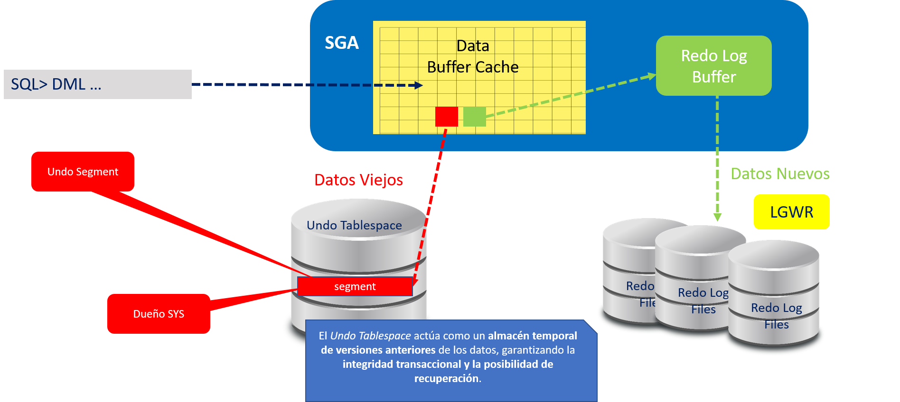

# **Práctica 5.5 Gestión del Undo Tablespace**

## **Objetivos**

* Verificar los parámetros de inicialización relacionados con la gestión del UNDO.
* Analizar el tamaño y uso del tablespace UNDO mediante scripts SQL predefinidos.
* Identificar los momentos de mayor consumo de bloques de UNDO activos.
* Configurar la retención del UNDO a 24 horas para habilitar operaciones de recuperación *Flashback*.

<br/><br/>

## **Duración estimada**

**25 minutos**

<br/><br/>

## **Tabla de ayuda**

| Concepto / Comando                | Descripción                                                                                                | Referencia                                                                                                                          |
| --------------------------------- | ---------------------------------------------------------------------------------------------------------- | ----------------------------------------------------------------------------------------------------------------------------------- |
| `UNDO_MANAGEMENT`                 | Define si el modo de administración del UNDO es manual o automático.                                       | [Oracle Docs – UNDO Management](https://docs.oracle.com/en/database/oracle/oracle-database/21/admin/managing-undo.html#GUID-2C865CF9-A8B5-4BF1-A451-E8C08D3611F0) |
| `UNDO_TABLESPACE`                 | Especifica el tablespace UNDO que utiliza la instancia.                                                    | Oracle 19c SQL Reference                                                                                                            |
| `UNDO_RETENTION`                  | Determina el tiempo (en segundos) que Oracle retiene la información UNDO para operaciones de recuperación. | Oracle Database Concepts                                                                                                            |
| `DBA_UNDO_EXTENTS`                | Vista para consultar el estado de los extents del UNDO.                                                    | Oracle Data Dictionary Views                                                                                                        |
| `ALTER SYSTEM SET UNDO_RETENTION` | Modifica la política de retención del UNDO.                                                                | SQL Language Reference                                                                                                              |

<br/><br/>

## **Objetivo visual**

El siguiente esquema muestra la relación entre las transacciones activas, el tablespace UNDO y las operaciones de *Flashback* dependientes de la retención configurada.



<br/><br/>

## **Instrucciones**

### **Tarea 1. Conexión al entorno**

1. Accede al sistema con el usuario `oracle`.
2. Configura el entorno de la base de datos:

   ```bash
   $ . oraenv   # orcl
   ```
3. Inicia sesión como usuario administrativo:

   ```bash
   $ sqlplus / as sysdba
   SQL> show user
   ```

<br/><br/>

### **Tarea 2. Consulta de parámetros del UNDO**

1. Dentro de SQL*Plus, muestra los parámetros relacionados con UNDO:

   ```sql
   SQL> show parameter undo
   ```
2. Anota los valores actuales de `undo_management`, `undo_tablespace` y `undo_retention`.

<br/><br/>

### **Tarea 3. Análisis del tamaño del tablespace UNDO**

1. Dirígete al directorio donde se encuentran los scripts:

   ```bash
   $ cd $HOME/codes/05_almacenamiento
   ```
2. Ejecuta el script para visualizar el tamaño actual del tablespace:

   ```bash
   $ sqlplus / as sysdba @p03_undosize.sql
   ```
3. Interpreta los resultados e identifica el tamaño asignado y los bloques en uso.

<br/><br/>

### **Tarea 4. Monitoreo del consumo de UNDO**

1. En el mismo directorio, ejecuta el siguiente script:

   ```bash
   $ sqlplus / as sysdba @p04_monitoreo.sql
   ```
2. Determina el momento del día en el que se generan más bloques UNDO activos.

3. Anota las horas de mayor actividad y analiza la relación con el volumen de transacciones.

<br/><br/>

### **Tarea 5. Configuración de la retención de UNDO a 24 horas**

1. Calcula el valor equivalente en segundos:

   ```
   24 horas = 24 × 60 × 60 = 86400
   ```

2. Modifica la retención del UNDO:

   ```sql
   SQL> ALTER SYSTEM SET UNDO_RETENTION = 86400;
   ```
   
3. Verifica el cambio con:

   ```sql
   SQL> SHOW PARAMETER undo_retention;
   ```

<br/><br/>

### **Tarea 6. Desafío**

Realiza un **experimento de recuperación con Flashback Query**:

1. Ejecuta una instrucción `DELETE` sobre una tabla de prueba.
2. Usa una consulta con `AS OF TIMESTAMP` para recuperar los datos borrados utilizando la información del UNDO.

   ```sql
   SELECT * FROM empleados AS OF TIMESTAMP (SYSTIMESTAMP - INTERVAL '1' HOUR);
   ```
3. Explica brevemente cómo el parámetro `UNDO_RETENTION` influye en la posibilidad de recuperación.

<br/><br/>

## **Resultado Esperado**

* Se muestran correctamente los parámetros de UNDO configurados.
* La base de datos queda configurada con una **retención de 24 horas** (`UNDO_RETENTION=86400`).
* El participante comprende la relación entre el tamaño, retención y capacidad de recuperación mediante *Flashback*.
