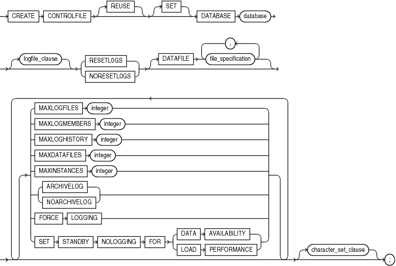

# **Práctica 5.6 Archivos de Control en Oracle Database**

## **Objetivos**

* Comprender el propósito del archivo de control dentro de la arquitectura de Oracle Database.
* Consultar el parámetro de inicialización `CONTROL_FILES` para ubicar los archivos asociados.
* Analizar la información almacenada en las vistas dinámicas `V$CONTROLFILE` y `V$CONTROLFILE_RECORD_SECTION`.
* Generar un respaldo manual del archivo de control utilizando comandos SQL.
* Interpretar la importancia del archivo de control en los procesos de inicio, checkpoint y recuperación de base de datos.

<br/><br/>

## **Duración estimada**

45 minutos

<br/><br/>

## **Tabla de ayuda**

| Comando / Vista                                 | Descripción                                                                                            | Ejemplo                                                                      |
| ----------------------------------------------- | ------------------------------------------------------------------------------------------------------ | ---------------------------------------------------------------------------- |
| `SHOW PARAMETER control_files`                  | Muestra las ubicaciones físicas de los archivos de control definidos en el parámetro de inicialización | `SQL> show parameter control_files;`                                         |
| `V$CONTROLFILE`                                 | Muestra el nombre, estado y tamaño de los archivos de control asociados a la base de datos             | `SELECT * FROM v$controlfile;`                                               |
| `V$CONTROLFILE_RECORD_SECTION`                  | Contiene información sobre las diferentes secciones de registros dentro del archivo de control         | `SELECT type, record_size, records_total FROM v$controlfile_record_section;` |
| `ALTER DATABASE BACKUP CONTROLFILE TO TRACE`    | Crea una copia del archivo de control en formato texto, útil para recrear la base de datos             | `ALTER DATABASE BACKUP CONTROLFILE TO TRACE;`                                |
| `ALTER DATABASE BACKUP CONTROLFILE TO TRACE AS` | Permite definir la ruta y el nombre del archivo de respaldo de control                                 | `ALTER DATABASE BACKUP CONTROLFILE TO TRACE AS '/home/oracle/control.trx';`  |

<br/><br/>

## **Objetivo visual**

El siguiente diagrama representa la relación del **archivo de control** con los **datafiles**, **redo logs** y **archivelogs**, mostrando su rol como elemento central de metadatos que permite la apertura y sincronización de la base de datos.



<br/><br/>

## **Instrucciones**

### **Tarea 1. Propósito del archivo de control**

1. Desde una sesión con privilegios de administrador, responde brevemente:

   * ¿Cuál es el propósito del archivo de control?
   * ¿Qué tipo de información contiene?

2. Registra tus respuestas en el archivo de texto `control_info.txt`.

<br/><br/>

### **Tarea 2. Ubicación del archivo de control**

1. Muestra el valor del parámetro de inicialización:

   ```sql
   SQL> SHOW PARAMETER control_files;
   ```
2. Verifica la ubicación física y el número de archivos definidos.

<br/><br/>

### **Tarea 3. Análisis de las vistas dinámicas**

1. Examina la vista `V$CONTROLFILE` para listar los archivos de control existentes:

   ```sql
   SQL> SELECT NAME, STATUS, IS_RECOVERY_DEST_FILE FROM V$CONTROLFILE;
   ```

2. Consulta la vista `V$CONTROLFILE_RECORD_SECTION` para identificar las secciones y registros que conforman el archivo de control:

   ```sql
   SQL> SELECT TYPE, RECORD_SIZE, RECORDS_TOTAL, RECORDS_USED FROM V$CONTROLFILE_RECORD_SECTION;
   ```

3. Exporta los resultados a un archivo plano mediante spool:

   ```sql
   SQL> SPOOL /home/oracle/control_sections.txt
   SQL> SELECT * FROM V$CONTROLFILE_RECORD_SECTION;
   SQL> SPOOL OFF;
   ```

<br/><br/>

### **Tarea 4. Respaldo del archivo de control**

1. Ejecuta el respaldo del archivo de control en formato texto:

   ```sql
   SQL> ALTER DATABASE BACKUP CONTROLFILE TO TRACE;
   ```

2. Genera un respaldo en una ubicación específica:

   ```sql
   SQL> ALTER DATABASE BACKUP CONTROLFILE TO TRACE AS '/home/oracle/control.trx';
   ```

3. Verifica el contenido del archivo generado usando un editor de texto:

   ```bash
   $ cat /home/oracle/control.trx
   ```

<br/><br/>

### **Tarea 5. Desafío**

Elabora un **script SQL único** que:

1. Muestre el nombre, tamaño y estado de todos los archivos de control.
2. Incluya un reporte con el número total de registros por tipo en `V$CONTROLFILE_RECORD_SECTION`.
3. Genere automáticamente el respaldo del archivo de control a una ubicación específica dentro del `$HOME` del usuario.

Guarda tu script como `p06_controlfile_cert.sql` y ejecútalo.

<br/><br/>

## **Resultado Esperado**

* Captura de pantalla mostrando:

  * El resultado del comando `SHOW PARAMETER control_files`.
  * El contenido resumido de las vistas `V$CONTROLFILE` y `V$CONTROLFILE_RECORD_SECTION`.
  * La confirmación del comando `ALTER DATABASE BACKUP CONTROLFILE TO TRACE` ejecutado exitosamente.
