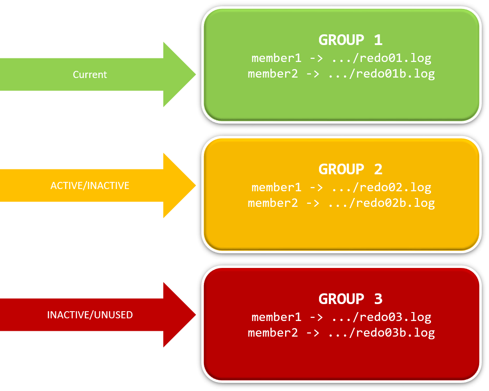

# **Práctica 5.7 Redo Logs**

## **Objetivos**

* Listar ubicación física, tipo y estado de los miembros del Redo Log online.
* Contar **grupos** y **miembros** y distinguir sus estados (`CURRENT`, `ACTIVE`, `INACTIVE`, `UNUSED`).
* **Crear** un grupo de redo log y **multiplexar** agregando un nuevo miembro.
* Verificar cambios y estados tras operaciones DDL y **forzar log switches** para observar transiciones.
* Reconocer y explicar estados temporales como **`INVALID`** en nuevos miembros.

<br/><br/>

## **Duración estimada**

40–55 minutos

<br/><br/>

## **Tabla de ayuda**

| Tema / Acción             | Comando / Vista                                        | Pista de uso                                   |
| ------------------------- | ------------------------------------------------------ | ---------------------------------------------- |
| Conexión DBA              | `sqlplus / as sysdba`                                  | Requiere privilegios SYSDBA                    |
| Miembros (archivo físico) | `V$LOGFILE (GROUP#, STATUS, TYPE, MEMBER)`             | `STATUS` puede verse `INVALID` al crear        |
| Grupos (estado lógico)    | `V$LOG (GROUP#, STATUS, BYTES, ARCHIVED)`              | `STATUS` = `CURRENT/ACTIVE/INACTIVE/UNUSED`    |
| Historial de switches     | `V$LOG_HISTORY`                                        | Validar `thread#`, `sequence#`, `first_time`   |
| Forzar switch             | `ALTER SYSTEM SWITCH LOGFILE;`                         | Cambia `CURRENT` al siguiente grupo disponible |
| Checkpoint manual         | `ALTER SYSTEM CHECKPOINT;`                             | Ayuda a pasar de `ACTIVE` → `INACTIVE`         |
| Crear grupo               | `ALTER DATABASE ADD LOGFILE (... ) SIZE 5M;`           | Crea **grupo nuevo** con 1+ miembros           |
| Agregar miembro           | `ALTER DATABASE ADD LOGFILE MEMBER 'ruta' TO GROUP n;` | **Multiplexar** un grupo existente             |
| Ver rutas largas          | `COL member FORMAT A60` + `SET LINESIZE 150`           | Mejora legibilidad                             |
| Limpieza (si aplica)      | `ALTER DATABASE DROP LOGFILE MEMBER 'ruta';`           | Úsalo solo si es necesario y seguro            |

<br/><br/>

## **Objetivo visual**

Diagrama conceptual del Redo Log online (grupos con miembros multiplexados):



<br/><br/>

## **Instrucciones**

### **Tarea 1. Acceso y preparación**

1. Conéctate como DBA:

   ```
   sqlplus / as sysdba
   ```
2. Mejora la legibilidad:

   ```sql
   SET LINESIZE 150
   COL member FORMAT A60
   ```

<br/><br/>

### **Tarea 2. Inventario actual de Redo Logs**

1. Lista miembros y su tipo/estado:

   ```sql
   SELECT group#, status, type, member
   FROM v$logfile
   ORDER BY 1;
   ```
2. Lista grupos y su estado lógico:

   ```sql
   SELECT group#, status, bytes/1024/1024 AS size_mb, archived
   FROM v$log
   ORDER BY group#;
   ```
3. Responde: ¿cuántos **grupos** existen? ¿Cuántos **miembros por grupo**?

<br/><br/>

### **Tarea 3. Crear un **nuevo grupo** con dos miembros**

> Usa las rutas del entorno del laboratorio (ajusta si tu ruta difiere).

```sql
ALTER DATABASE ADD LOGFILE
('/u02/oradata/orcl/nlog01.rdo', '/u02/oradata/orcl/nlog02.rdo') SIZE 5M;
```

> Nota: la extensión puede ser `.log` o `.rdo`; la funcionalidad es la misma.

<br/><br/>

### **Tarea 4. Verificación del nuevo grupo**

1. Verifica que el grupo se haya creado y observa `STATUS` de los **miembros**:

   ```sql
   SELECT group#, status, type, member
   FROM v$logfile
   ORDER BY 1;
   ```
2. Verifica el **estado lógico** del grupo nuevo:

   ```sql
   SELECT group#, status, bytes/1024/1024 size_mb
   FROM v$log
   ORDER BY group#;
   ```

<br/><br/>

### **Tarea 5. Multiplexar: agregar un miembro adicional al nuevo grupo**

> Suponiendo que el nuevo grupo creado es el **4** (ajusta el número si tu entorno difiere):

```sql
ALTER DATABASE ADD LOGFILE MEMBER '/u02/oradata/orcl/nlog03.log' TO GROUP 4;
```

<br/><br/>

### **Tarea 6. Comprobación de estados y transición**

1. Revisa otra vez los miembros:

   ```sql
   SELECT group#, status, type, member
   FROM v$logfile
   ORDER BY 1;
   ```

   > Es **normal** ver `INVALID` inmediatamente después de crear/añadir un miembro. Cambiará tras su primer uso.
2. Observa el estado lógico del grupo 4:

   ```sql
   SELECT group#, status
   FROM v$log
   WHERE group# = 4;
   ```
3. **Fuerza un log switch** para acelerar la transición y observar cambios:

   ```sql
   ALTER SYSTEM SWITCH LOGFILE;
   ALTER SYSTEM CHECKPOINT;
   ```
4. Vuelve a consultar `V$LOG` y `V$LOGFILE` y **documenta** el estado final observado.

<br/><br/>

### **Tarea 7. Validación con historial (opcional)**

1. Comprueba el historial de switches:

   ```sql
   SELECT sequence#, first_time
   FROM v$log_history
   ORDER BY first_time DESC FETCH FIRST 5 ROWS ONLY;
   ```

<br/><br/>

### **Tarea 8. Pregunta guía**

* ¿Cuál es el **estado** del grupo creado en la Tarea 3 tras los switches? Explica por qué puede aparecer como `UNUSED`, `ACTIVE`, `INACTIVE` o `CURRENT`.

<br/><br/>

### **Tarea 9. Desafío**

Diseña un script (un solo bloque de ejecución) que:

1. Muestre: **total de grupos**, **miembros por grupo** (conteo), **rutas** y estado lógico del grupo.
2. Si existe algún grupo con **un solo miembro**, **agregue** automáticamente un **segundo miembro** en `/u02/oradata/orcl/auto_<group#>.log`.
3. Fuerce **dos log switches** y un **checkpoint**, y luego muestre el cambio de estados.
   *(No elimines nada; solo agrega miembros cuando falte multiplexing).*


**Pistas técnicas (no obligatorias):**

* Puedes usar un PL/SQL anónimo con un cursor sobre `V$LOG` y `V$LOGFILE`.
* Para contar miembros por grupo: `COUNT(*) OVER (PARTITION BY group#)` en una CTE.


## **Resultado Esperado**

Al finalizar, deberás tener:

* Un **grupo nuevo** de redo log creado con **2–3 miembros** visibles en `V$LOGFILE`.
* Evidencia (capturas o salida) de:

  * Inventario **antes** y **después** (`V$LOG`, `V$LOGFILE`).
  * El grupo añadido y su **estado** actual (idealmente distinto de `INVALID` tras el primer uso).
  * **Log switches** registrados en `V$LOG_HISTORY`.
* Una breve **conclusión**: cantidad de grupos/miembros finales, justificación del tamaño usado (5M en el ejemplo) y explicación de por qué es buena práctica **multiplexar** redo logs.

<br/><br/>

## **Guion de referencia (rápido)**

> Úsalo si necesitas comprobar tu avance; **ajusta rutas y group#** a tu ambiente.

```sql
-- Conexión
sqlplus / as sysdba

-- Legibilidad
SET LINESIZE 150
COL member FORMAT A60

-- Inventario inicial
SELECT group#, status, bytes/1024/1024 size_mb, archived FROM v$log ORDER BY group#;
SELECT group#, status, type, member FROM v$logfile ORDER BY 1;

-- Crear grupo con dos miembros
ALTER DATABASE ADD LOGFILE
('/u02/oradata/orcl/nlog01.rdo','/u02/oradata/orcl/nlog02.rdo') SIZE 5M;

-- Verificación
SELECT group#, status, type, member FROM v$logfile ORDER BY 1;
SELECT group#, status FROM v$log WHERE group# = (SELECT MAX(group#) FROM v$log);

-- Agregar miembro adicional (ajusta el número de grupo si no es 4)
ALTER DATABASE ADD LOGFILE MEMBER '/u02/oradata/orcl/nlog03.log' TO GROUP 4;

-- Comprobaciones y transición
SELECT group#, status, type, member FROM v$logfile ORDER BY 1;
SELECT group#, status FROM v$log WHERE group# = 4;

ALTER SYSTEM SWITCH LOGFILE;
ALTER SYSTEM CHECKPOINT;

SELECT group#, status FROM v$log ORDER BY group#;
SELECT sequence#, first_time FROM v$log_history ORDER BY first_time DESC FETCH FIRST 5 ROWS ONLY;
```

**Nota sobre `INVALID` en `V$LOGFILE`:** es esperado inmediatamente después de crear/añadir un miembro; el estado se normaliza cuando el archivo es utilizado por el grupo (tras un switch y escritura).
