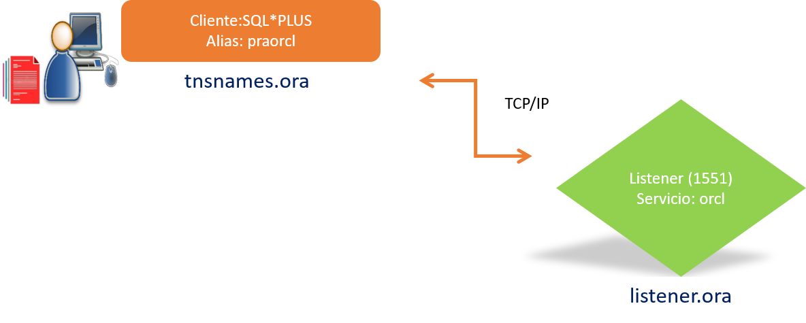

# **Práctica 6.1 Creación de Network Service**

## **Objetivos**

* Identificar los archivos principales de configuración de red de Oracle.
* Crear un *Service Naming* utilizando **Oracle Net Manager**.
* Probar la conexión a la base de datos con un alias de red definido.
* Validar la sesión y el entorno de instancia desde **SQL*Plus**.
* Realizar respaldos preventivos de los archivos de configuración antes de los cambios.

<br/><br/>

## **Duración estimada**

30 minutos

<br/><br/>

## **Tabla de ayuda**

| Concepto / Archivo            | Descripción breve                                               | Ubicación o comando                |
| ----------------------------- | --------------------------------------------------------------- | ---------------------------------- |
| `listener.ora`                | Configura el listener (puerto, servicio, protocolo)             | `$ORACLE_HOME/network/admin/`      |
| `tnsnames.ora`                | Define los alias de conexión (service naming)                   | `$ORACLE_HOME/network/admin/`      |
| `netmgr`                      | Oracle Net Manager – interfaz gráfica para configuración de red | `$ netmgr`                         |
| `lsnrctl status`              | Verifica el estado del listener activo                          | `$ lsnrctl status`                 |
| `show parameter service_name` | Muestra el nombre de servicio de la base                        | `SQL> show parameter service_name` |
| `sqlplus hr/Oracle1@praorcl`  | Conexión con el alias configurado                               | Desde terminal                     |

<br/><br/>

## **Objetivo visual**

El siguiente diagrama representa la interacción entre el cliente Oracle y el listener local a través del servicio **praorcl**:



<br/><br/>

## **Instrucciones**

### **Tarea 1: Preparar el entorno**

1. Establece la variable de entorno de Oracle:

   ```bash
   $ . oraenv
   orcl
   ```
2. Crea respaldos de los archivos de configuración:

   ```bash
   $ cp $ORACLE_HOME/network/admin/tnsnames.ora $HOME/tnsnames.backup
   $ cp $ORACLE_HOME/network/admin/listener.ora $HOME/listener.backup
   ```

<br/><br/>

### **Tarea 2: Configurar el nuevo servicio**

1. Ejecuta la herramienta **Oracle Net Manager**:

   ```bash
   $ netmgr
   ```
2. En el árbol de navegación, expande la opción **Local** y selecciona **Service Naming**.
3. Haz clic en el símbolo **+** (verde) para crear un nuevo servicio.
4. Especifica el nombre: **praorcl**.
5. Selecciona el protocolo **TCP/IP**.
6. Introduce los valores:

   * **Host:** `localhost.localdomain`
   * **Puerto:** `1551`
7. Selecciona el **Service Name**: `orcl`.
8. Guarda los cambios con **File → Save Network Configuration**.

<br/><br/>

### **Tarea 3: Validar la conexión**

1. Prueba la conexión desde Net Manager con las credenciales:

   * Usuario: `hr`
   * Contraseña: `Oracle1` 

2. Cierra la herramienta y verifica desde SQL*Plus:

   ```bash
   $ sqlplus hr/Oracle1@praorcl
   ```
3. Comprueba la sesión:

   ```sql
   SQL> show user;
   SQL> show con_name;
   SQL> select instance_name, host_name from v$instance;
   ```

<br/><br/>

### **Tarea 4. Desafío**

Configura un **segundo servicio de red** llamado `pradev`, con puerto **1560** y service name `orcl`.
Verifica la conexión desde SQL*Plus y documenta los archivos modificados y las diferencias con el servicio `praorcl`.

<br/><br/>

## **Resultado Esperado**

* Archivos `tnsnames.ora` y `listener.ora` respaldados y actualizados correctamente.
* Nuevo alias de red (`praorcl`) configurado y probado exitosamente.
* Conexión verificada desde **SQL*Plus** mostrando usuario **HR** y la instancia **ORCL**.
* Registro visual (captura) del resultado del comando:

  ```sql
  SQL> select instance_name, host_name from v$instance;
  ```


```
INSTANCE_NAME  HOST_NAME
-------------- --------------------
orcl           localhost.localdomain
```
