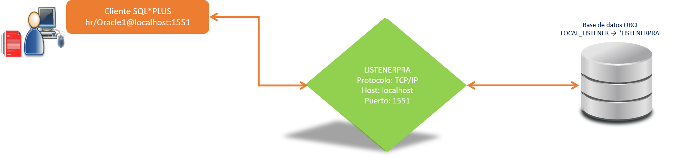

# **Práctica 6.3 Uso del Nuevo Listener**

## **Objetivos**

* Consultar y modificar el parámetro `LOCAL_LISTENER` en la base de datos.
* Asociar la instancia ORCL al listener alterno `LISTENERPRA`.
* Verificar el estado operativo del listener mediante comandos administrativos.
* Probar la conexión desde SQL*Plus y SQL Developer con el nuevo puerto configurado.
* Asegurar la persistencia de los cambios tras reiniciar la base de datos.

<br/><br/>

## **Duración estimada**

30 minutos

<br/><br/>

## **Tabla de ayuda**

| Comando / Archivo                               | Descripción breve                              | Ubicación o uso               |
| ----------------------------------------------- | ---------------------------------------------- | ----------------------------- |
| `show parameter local_listener`                 | Muestra el valor actual del parámetro          | SQL*Plus                      |
| `alter system set local_listener='LISTENERPRA'` | Asocia la instancia con el nuevo listener      | SQL*Plus (SYSDBA)             |
| `lsnrctl status LISTENERPRA`                    | Verifica el estado del listener activo         | Terminal                      |
| `sqlplus hr/Oracle1@localhost:1551/orcl`        | Prueba la conexión mediante el nuevo listener  | Terminal                      |
| `$ . oraenv`                                    | Configura variables de entorno ORACLE_SID      | Shell                         |
| `shutdown immediate / startup`                  | Reinicia la base de datos para aplicar cambios | SQL*Plus                      |
| `listener.ora` / `tnsnames.ora`                 | Archivos de configuración de red               | `$ORACLE_HOME/network/admin/` |

<br/><br/>

## **Objetivo visual**

El siguiente diagrama representa la comunicación entre la instancia **ORCL** y el nuevo listener **LISTENERPRA** tras la modificación del parámetro `LOCAL_LISTENER`:




<br/><br/>

## **Instrucciones**

### **Tarea 1: Preparar el entorno**

1. Configura las variables de entorno:

   ```bash
   $ . oraenv
   orcl
   ```
2. Inicia sesión como administrador:

   ```bash
   $ sqlplus / as sysdba
   ```

<br/><br/>

### **Tarea 2: Verificar y modificar el parámetro**

1. Consulta el valor actual del parámetro:

   ```sql
   SQL> show parameter local_listener;
   ```
2. Modifica el parámetro para asociarlo al nuevo listener:

   ```sql
   SQL> alter system set LOCAL_LISTENER='LISTENERPRA' SCOPE=BOTH;
   ```
3. Verifica el cambio:

   ```sql
   SQL> show parameter local_listener;
   ```

<br/><br/>

### **Tarea 3: Verificar el listener y probar la conexión**

1. Comprueba que el listener está activo:

   ```bash
   $ lsnrctl status LISTENERPRA
   ```
2. Prueba la conexión a la base de datos usando el nuevo listener:

   ```bash
   $ sqlplus hr/Oracle1@localhost:1551/orcl
   ```
3. Muestra los detalles de la sesión conectada:

   ```sql
   SQL> show user;
   SQL> select instance_name, host_name from v$instance;
   ```

<br/><br/>

### **Tarea 4: Validar en SQL Developer**

1. Abre **SQL Developer**.
2. Edita la conexión asociada a **ORCL**:

   * **Host:** `localhost`
   * **Puerto:** `1551`
   * **Service name:** `orcl`
3. Prueba la conexión y guarda los cambios.

<br/><br/>

### **Tarea 5: Reiniciar la base de datos**

1. Reinicia la base de datos para garantizar la persistencia de la configuración:

   ```sql
   SQL> shutdown immediate;
   SQL> startup;
   ```
2. Verifica nuevamente el parámetro:

   ```sql
   SQL> show parameter local_listener;
   ```

<br/><br/>

### **Tarea 6. Desafío**

Crea un **script SQL** llamado `config_listener.sql` que automatice el proceso de:

* Mostrar el parámetro actual.
* Modificar el `LOCAL_LISTENER` a `LISTENERPRA`.
* Verificar el cambio.
* Ejecutar una prueba de conexión desde la línea de comandos.

Guarda y comenta cada instrucción dentro del script.

<br/><br/>

## **Resultado Esperado**

* El parámetro `LOCAL_LISTENER` apunta correctamente a `LISTENERPRA`.
* El listener `LISTENERPRA` aparece activo en estado **READY**.
* Las conexiones a la base de datos **ORCL** funcionan en el puerto **1551** desde SQL*Plus y SQL Developer.
* La configuración se mantiene tras reiniciar la base de datos.


```
SQL> show parameter local_listener

NAME              TYPE   VALUE
----------------- ------ ---------------
local_listener    string LISTENERPRA

SQL> select instance_name from v$instance;

INSTANCE_NAME
--------------
orcl
```
