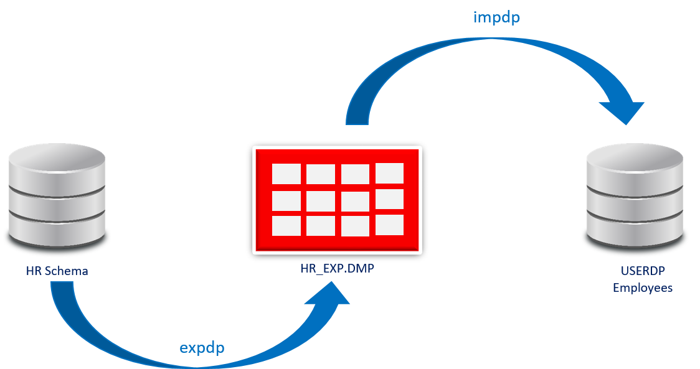

# **Práctica 7.1 Uso de Oracle Data Pump**

## **Objetivos**

* Identificar y verificar el **directorio lógico** configurado en Oracle para Data Pump.
* Ejecutar una **exportación lógica** del esquema HR con `expdp`.
* Analizar los archivos de salida generados por Data Pump (`.dmp` y `.log`).
* Realizar una **importación parcial** (solo tabla `EMPLOYEES`) hacia otro usuario.
* Validar el resultado de la importación mediante consultas de verificación.

<br/><br/>

## **Duración estimada**

45 minutos

<br/><br/>


## **Tabla de ayuda**

| Concepto                   | Descripción                                                          | Ejemplo / Uso                                                                               |
| -------------------------- | -------------------------------------------------------------------- | ------------------------------------------------------------------------------------------- |
| **Directorio lógico**      | Objeto de base de datos que apunta a una ruta del sistema operativo. | `SELECT directory_name, directory_path FROM dba_directories;`                               |
| **Grant sobre directorio** | Permite a un usuario leer o escribir en el directorio Data Pump.     | `GRANT READ, WRITE ON DIRECTORY data_pump_dir TO userdp;`                                   |
| **expdp**          | Exporta datos u objetos desde la base.                               | `expdp userdp/Oracle1 SCHEMAS=HR DIRECTORY=data_pump_dir DUMPFILE=HR_EXP%U.dmp`             |
| **impdp**          | Importa datos previamente exportados.                                | `impdp userdp/Oracle1 DIRECTORY=data_pump_dir DUMPFILE=HR_EXP01.dmp REMAP_SCHEMA=hr:userdp` |
| **Remapeo de esquema**     | Permite importar objetos de un esquema a otro distinto.              | `REMAP_SCHEMA=hr:userdp`                                                                    |
| **Archivos generados**     | `.dmp` (dump de datos) y `.log` (bitácora de ejecución).             | `/u01/app/oracle/admin/orcl/dpdump/hr_ex_exp.log`                                           |

<br/><br/>


## **Objetivo visual**

El siguiente diagrama representa el flujo lógico del proceso de exportación e importación mediante **Oracle Data Pump**:



<br/><br/>

## **Instrucciones**

### **Tarea 1. Configuración inicial**

1. Conéctate a la base de datos con privilegios SYSDBA:

   ```bash
   $ . oraenv   # orcl
   $ sqlplus / as sysdba
   ```
2. Consulta el directorio configurado para Data Pump:

   ```sql
   SQL> SET linesize 160
   SQL> COL owner FORMAT a15
   SQL> COL directory_name FORMAT a25
   SQL> COL directory_path FORMAT a60
   SQL> SELECT owner, directory_name, directory_path FROM dba_directories;
   ```

   *Ejemplo típico:* `/u01/app/oracle/admin/orcl/dpdump/`

<br/><br/>

### **Tarea 2. Limpieza y preparación**


1. Ejecuta el script de preparación:

   ```bash
   $ sqlplus / as sysdba @$HOME/codes/07_movimiento/p01.sql
   ```

2. En caso de no tener el archivo p01.sql, puedes tomar el código del siguiente bloque
   
   ```sql
   --
   -- Curso Oracle 19c SQL & ADM
   --

   drop user userdp cascade;

   drop tablespace ts_userdp including contents and datafiles;

   create tablespace ts_userdp datafile '/u02/oradata/orcl/df_userdp' size 250m;

   create user userdp identified by Oracle1 account unlock default tablespace ts_userdp;

   grant create session, create table, unlimited tablespace to userdp;

   grant exp_full_database to userdp;

   quit
   ```
2. Elimina posibles archivos previos:

   ```bash
   $ rm -r /u01/app/oracle/admin/orcl/dpdump/*.dmp
   ```

<br/><br/>

### **Tarea 3. Otorgar privilegios al usuario Data Pump**

Concede permisos al usuario `userdp`:

```sql
SQL> GRANT READ, WRITE ON DIRECTORY data_pump_dir TO userdp;
```

<br/><br/>

### **Tarea 4. Exportación del esquema HR**

Ejecuta la exportación con `expdp`:

```bash
$ expdp userdp/Oracle1 \
  dumpfile=HR_EXP%U.dmp \
  directory=DATA_PUMP_DIR \
  logfile=hr_ex_exp.log \
  SCHEMAS=HR
```

Verifica los archivos generados:

```bash
$ ls -l /u01/app/oracle/admin/orcl/dpdump/*.dmp
```

<br/><br/>

### **Tarea 5. Importación parcial de tabla EMPLOYEES**

Importa la tabla `EMPLOYEES` remapeando el esquema:

```bash
$ impdp userdp/Oracle1 \
  directory=DATA_PUMP_DIR \
  dumpfile=HR_EXP01.dmp \
  REMAP_SCHEMA=hr:userdp \
  TABLES=hr.employees \
  logfile=hr_imp.log
```

<br/><br/>

### **Tarea 6. Validación final**

1. Conéctate como `userdp`:

   ```bash
   $ . oraenv  # orcl
   $ sqlplus userdp/Oracle1
   ```
2. Verifica la importación:

   ```sql
   SQL> SHOW USER;
   SQL> SELECT COUNT(*) FROM employees;
   SQL> COL object_name FORMAT a20;
   SQL> SELECT object_name, object_type FROM user_objects;
   ```

<br/><br/>

### **Tarea 7. Desafío**

Utiliza **parámetros avanzados de Data Pump** para exportar únicamente las tablas cuyos nombres comiencen con la letra `E` (por ejemplo, `EMPLOYEES`, `EMP_DETAILS_VIEW`).
Sugerencia: investiga el parámetro `INCLUDE`.

<br/><br/>

## **Resultado Esperado**

* Se genera el archivo `HR_EXP01.dmp` y la bitácora `hr_ex_exp.log` en el directorio físico `/u01/app/oracle/admin/orcl/dpdump/`.
* El usuario `userdp` posee la tabla `EMPLOYEES` correctamente importada y consultable.
* Los resultados de verificación muestran coincidencia en el número de filas entre los esquemas HR y USERDP.

 

```sql
SQL> SELECT COUNT(*) FROM hr.employees;
COUNT(*) = 107

SQL> SELECT COUNT(*) FROM userdp.employees;
COUNT(*) = 107
```

