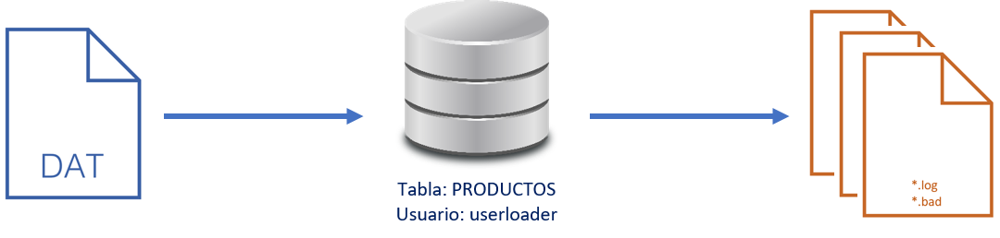

# **Práctica 7.2 Carga de Datos con SQL*Loader**


## **Objetivos**

* Comprender el funcionamiento del **SQL*Loader** en modo express y con archivo de control.
* Preparar el entorno y los datos fuente para la carga.
* Ejecutar cargas de datos en tablas del esquema `userloader`.
* Verificar los resultados de carga mediante consultas SQL y bitácoras generadas.
* Analizar el contenido de los archivos de datos y las estructuras utilizadas.

<br/><br/>

## **Duración estimada**

45 minutos

<br/><br/>

## **Tabla de ayuda**

| Concepto                      | Descripción                                                             | Ejemplo / Uso                                       |
| ----------------------------- | ----------------------------------------------------------------------- | --------------------------------------------------- |
| **SQL*Loader**                | Herramienta de Oracle para cargar datos externos a tablas.              | `sqlldr userloader/Oracle1 control=p03.ctl`         |
| **Modo express**              | Carga directa indicando solo el nombre de la tabla y usuario.           | `sqlldr userloader/Oracle1 table=productos`         |
| **Archivo de control (.ctl)** | Define estructura y reglas de carga (columnas, delimitadores, formato). | `LOAD DATA INFILE 'datos.dat' INTO TABLE productos` |
| **Archivo de datos (.dat)**   | Contiene los registros a importar en formato delimitado o fijo.         | `101,Mouse,250`                                     |
| **Archivo log (.log)**        | Reporta el resultado de la carga (filas insertadas, errores).           | `productos.log`, `labdatos.log`                     |
| **Archivo bad (.bad)**        | Guarda los registros que no se pudieron cargar.                         | `productos.bad`                                     |

<br/><br/>

## **Objetivo visual**

El siguiente esquema muestra el flujo general de una carga de datos con **SQL*Loader**:



> El archivo `.bad` se genera solo si existen errores de carga.

<br/><br/>

## **Instrucciones**

### **Tarea 1. Preparación inicial**

1. Configura el ambiente y ejecuta el script inicial:

   ```bash
   $ . oraenv  # orcl
   $ cd $HOME/codes/07_movimientos
   $ sqlplus / as sysdba @p02.sql
   ```

2. Si no tienes el archivo p02.sql, puedes tomar el código del siguiente bloque:

   ```sql
   --
   -- Curso Oracle 19c SQL & ADM
   --

   drop user userloader cascade;

   drop tablespace ts_loader including contents and datafiles;

   create tablespace ts_loader datafile '/u02/oradata/orcl/df_loader' size 20m;

   create user userloader identified by Oracle1 account unlock default tablespace ts_loader;

   grant create session, create table, unlimited tablespace to userloader;

   conn userloader/Oracle1

   create table productos (
      sku number primary key,
      region char(3),
      descripcion varchar2(80),
      tipo varchar2(20)
   );

   desc userloader.productos

   quit
   ```

<br/><br/>

### **Tarea 2. Verificar archivo de datos**

1. Localiza y analiza el archivo `productos.dat`:

   ```bash
   $ cd $HOME/codes/07_movimientos
   $ file productos.dat
   $ cat productos.dat
   ```

   Observa el formato y la cantidad de columnas que se insertarán.

<br/><br/>

### **Tarea 3. Carga express con SQL*Loader**

1. Ejecuta la carga directa sin archivo de control:

   ```bash
   $ sqlldr userloader/Oracle1 table=productos
   ```

<br/><br/>

### **Tarea 4. Validación de resultados**

1. Revisa los archivos de bitácora generados:

   ```bash
   $ cd $HOME/codes/07_movimientos
   $ file productos.log
   $ more productos.log
   ```

2. Verifica la información cargada:

   ```bash
   $ sqlplus userloader/Oracle1
   SQL> SELECT COUNT(*) FROM productos;
   SQL> SELECT * FROM productos;
   ```

<br/><br/>

### **Tarea 5. Ejecución del segundo script**

1. Como DBA, ejecuta el siguiente script de preparación:

   ```bash
   $ cd $HOME/codes/07_movimientos
   $ sqlplus / as sysdba @p03.sql
   ```

<br/><br/>

### **Tarea 6. Análisis del archivo de datos adicional**

1. Examina el archivo `datos.dat`:

   ```bash
   $ cd $HOME/codes/07_movimientos
   $ ls -l datos.dat
   $ file datos.dat
   $ wc -l datos.dat  # Número de registros a insertar
   ```

<br/><br/>

### **Tarea 7. Carga con archivo de control**

1. Ejecuta SQL*Loader con el archivo de control `p03.ctl`:

   ```bash
   $ sqlldr userid=userloader/Oracle1 control=p03.ctl log=labdatos.log data=datos.dat
   ```

<br/><br/>

### **Tarea 8. Revisión de bitácora**

1. Revisa la bitácora generada:

   ```bash
   $ cd $HOME/codes/07_movimientos
   $ more labdatos.log
   ```

<br/><br/>

### **Tarea 9. Verificación de carga**

1. Valida la información cargada en la tabla destino:

   ```bash
   $ sqlplus userloader/Oracle1
   SQL> SELECT COUNT(*) FROM cruce_ccm;
   SQL> SELECT * FROM cruce_ccm;
   ```

<br/><br/>

### **Tarea 10. Desafío**

Crea tu propio archivo `.dat` con registros adicionales para la tabla `productos` y genera un **archivo de control personalizado (.ctl)** que:

* Especifique delimitador `,` (coma).
* Use la cláusula `APPEND` para añadir registros sin borrar los existentes.
* Genere archivos `.log` y `.bad` en un directorio de tu elección.

Ejecuta la carga y analiza la bitácora resultante.

<br/><br/>

## **Resultado Esperado**

* Se ejecutan correctamente dos cargas de datos:

  * **Carga express** de la tabla `productos`.
  * **Carga controlada** mediante archivo `p03.ctl` hacia la tabla `cruce_ccm`.
* Las bitácoras (`productos.log`, `labdatos.log`) muestran el número de registros cargados exitosamente.
* El conteo de filas en las tablas `userloader.productos` y `cruce_ccm` coincide con el número de registros en los archivos `.dat`.

 

```sql
SQL> SELECT COUNT(*) FROM userloader.productos;
COUNT(*) = 10

SQL> SELECT COUNT(*) FROM cruce_ccm;
COUNT(*) = 500
```
