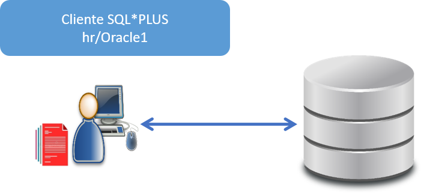
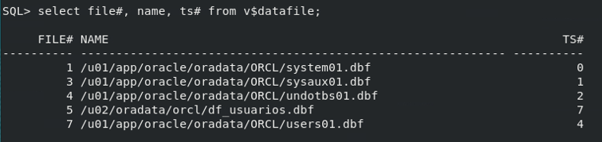

# **Práctica 8.1 Uso de SQL*Plus**

## **Objetivos**

* Conectarse a Oracle Database desde la interfaz de línea de comandos SQL*Plus.
* Verificar el usuario actual y describir la estructura de una tabla.
* Personalizar la sesión modificando variables como `SQLPROMPT`, `LINESIZE`, `PAGESIZE` y el formato de columnas.
* Ejecutar consultas SQL con formato mejorado.
* Cambiar entre usuarios dentro de una misma sesión SQL*Plus.

<br/><br/>

## **Duración estimada**

**25 minutos**

<br/><br/>

## **Tabla de ayuda**

| Comando                                   | Descripción                                   | Ejemplo                                    |
| ----------------------------------------- | --------------------------------------------- | ------------------------------------------ |
| `sqlplus user/password@host:port/service` | Conecta a Oracle Database usando SQL*Plus     | `sqlplus hr/Oracle1@localhost:1521/XEPDB1` |
| `show user`                               | Muestra el usuario actual conectado           | `SQL> show user`                           |
| `desc <tabla>`                            | Describe la estructura de una tabla           | `SQL> desc employees`                      |
| `connect user/password as sysdba`         | Cambia de sesión a SYSDBA                     | `SQL> connect system/Oracle1 as sysdba`    |
| `set linesize N`                          | Cambia el ancho máximo de línea en caracteres | `SQL> set linesize 140`                    |
| `set pagesize N`                          | Cambia el número de líneas por página         | `SQL> set pagesize 40`                     |
| `column <col> format aN`                  | Ajusta el ancho de una columna de texto       | `SQL> column name format a60`              |
| `clear screen`                            | Limpia la pantalla                            | `SQL> clear screen`                        |

<br/><br/>

## **Objetivo Visual**

El siguiente diagrama representa la interacción entre el usuario, la herramienta SQL*Plus y la base de datos Oracle:



<br/><br/>

## **Instrucciones**

### **Tarea 1. Conexión inicial con SQL*Plus**

1. Inicia sesión en tu entorno de Oracle Database.
2. Abre la terminal o el símbolo del sistema.
3. Conéctate al usuario HR:

   ```sql
   sqlplus hr/Oracle1@localhost:1521/XEPDB1
   ```
4. Verifica el usuario conectado:

   ```sql
   show user
   ```
5. Describe la estructura de la tabla `EMPLOYEES`:

   ```sql
   desc employees
   ```
6. Ejecuta una consulta que muestre el nombre, apellido y salario de los empleados:

   ```sql
   select first_name, last_name, salary from employees;
   ```

<br/><br/>

### **Tarea 2. Conexión con usuario SYSTEM**

1. Cambia de sesión al usuario SYSTEM con privilegios SYSDBA:

   ```sql
   connect system/Oracle1 as sysdba
   ```
2. Cambia el prompt por uno personalizado:

   ```sql
   set sqlprompt "SQLPLUS>"
   ```

<br/><br/>

### **Tarea 3. Personalización del formato de salida**

1. Modifica el tamaño de línea y de página para mejorar la visualización:

   ```sql
   set linesize 140
   set pagesize 40
   ```
2. Ajusta el ancho de la columna `NAME` a 60 caracteres:

   ```sql
   column name format a60
   ```
3. Limpia la pantalla:

   ```sql
   clear screen
   ```

<br/><br/>

### **Tarea 4. Generación de reporte**

1. Ejecuta la siguiente consulta para visualizar los datafiles de la base de datos con el nuevo formato:

   ```sql
   select file#, name, ts# from v$datafile;
   ```
2. Observa cómo los cambios de formato mejoran la legibilidad del reporte.

<br/><br/>

### **Tarea 5. Desafío**

Crea un **script SQL** llamado `reporte_db.sql` que:

* Se conecte automáticamente al usuario SYSTEM.
* Configure el prompt, el tamaño de línea y página.
* Ejecute las consultas:

  ```sql
  show user;
  select file#, name, ts# from v$datafile;
  select tablespace_name, file_name from dba_data_files;
  ```
* Guarde la salida del script en un archivo llamado `reporte_db.lst`.

<br/><br/>

## **Resultado Esperado**

Al finalizar la práctica deberás obtener un reporte en pantalla (y opcionalmente en archivo) similar al siguiente:



El reporte debe mostrar los archivos de datos con un formato legible y organizado, evidenciando la correcta configuración del entorno SQL*Plus.

