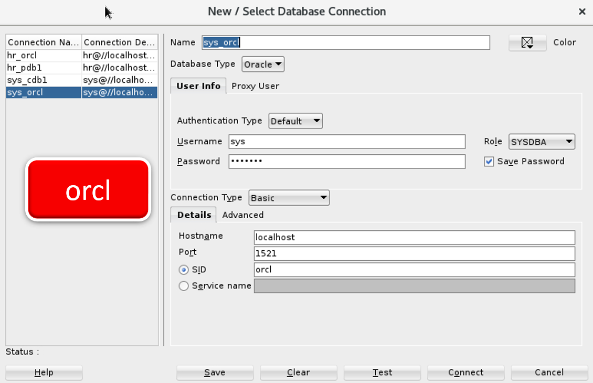
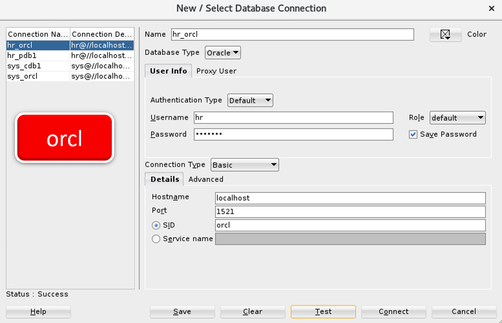
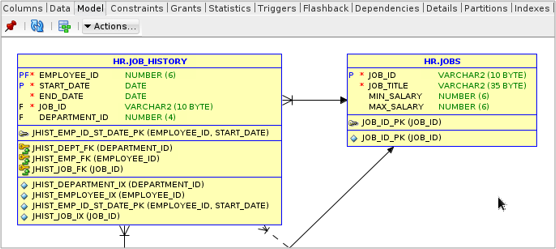

# **Práctica 8.2 Uso de Oracle SQL Developer**

## **Objetivos**

* Instalar y ejecutar Oracle SQL Developer en el entorno Linux/Oracle.
* Configurar las preferencias iniciales del entorno.
* Crear y gestionar conexiones hacia bases de datos Oracle.
* Desbloquear cuentas de usuario y asignar roles según el tipo de conexión.
* Ejecutar comandos y scripts administrativos desde SQL Developer.

<br/><br/>

## **Duración estimada**

**35 minutos**

<br/><br/>

## **Tabla de ayuda**

| Acción / Comando                                | Descripción                                  | Ejemplo o Valor   |
| ----------------------------------------------- | -------------------------------------------- | ----------------- |
| `unzip sqldeveloper-22.2.1.234.1810-no-jre.zip` | Descomprime el archivo del instalador        | `$HOME/software/` |
| `cd $HOME/sqldeveloper`                         | Cambia al directorio del programa            | —                 |
| `./sqldeveloper.sh &`                           | Ejecuta la herramienta SQL Developer         | —                 |
| Usuario SYS                                     | Usuario con privilegios administrativos      | Rol: SYSDBA       |
| Usuario HR                                      | Usuario de esquema de ejemplo                | Rol: Default      |
| `shutdown immediate`                            | Detiene la base de datos de forma controlada | —                 |
| `startup`                                       | Inicia la base de datos                      | —                 |
| `show user`                                     | Muestra el usuario conectado                 | —                 |

<br/><br/>

## **Objetivo Visual**

El siguiente diagrama muestra la relación entre el entorno gráfico de **SQL Developer**, las **conexiones de usuario****.



<br/><br/>

## **Instrucciones**

### **Tarea 1. Instalación y configuración inicial**

1. Descomprime el archivo de instalación en tu directorio personal:

   ```bash
   unzip $HOME/software/sqldeveloper-22.2.1.234.1810-no-jre.zip -d $HOME
   ```

2. Accede al directorio del programa:

   ```bash
   cd $HOME/sqldeveloper
   ```

3. Ejecuta SQL Developer:

   ```bash
   ./sqldeveloper.sh &
   ```

4. Si aparece el mensaje:
   *“Would you like to import preferences from a previous SQL Developer installation?”*,
   selecciona **No**.

5. En la ventana de preferencias iniciales, **desactiva** la opción *Allow automated usage reporting to Oracle* y pulsa **[OK]**.

6. Cierra la ventana de bienvenida.

<br/><br/>

### **Tarea 2. Creación de conexiones**

1. Crea una conexión para el usuario **SYS (Administrador)**:

   * **Nombre de conexión:** `SYS_ADMIN`
   * **Usuario:** `sys`
   * **Contraseña:** `Oracle1`
   * **Guardar contraseña:** Sí
   * **Rol:** `SYSDBA`
   * **Puerto:** `1521`
   * **SID:** `orcl`
   * Pulsa **Test**, verifica el estado “Successful”, y guarda la conexión.

   

2. Crea una conexión para el usuario **HR (usuario de práctica)**:

   * **Nombre de conexión:** `HR_USER`
   * **Usuario:** `hr`
   * **Contraseña:** `Oracle1`
   * **Guardar contraseña:** Sí
   * **Rol:** `Default`
   * **Puerto:** `1521`
   * **SID:** `orcl`
   * Pulsa **Test**, verifica la conexión y guarda.

   

<br/><br/>

### **Tarea 3. Desbloqueo de la cuenta HR (si aplica)**

Si la cuenta **HR** está bloqueada, realiza los siguientes pasos desde SQL Developer conectado como **SYSDBA**:

1. Abre una nueva hoja SQL y ejecuta:

   ```sql
   ALTER USER hr ACCOUNT UNLOCK;
   ALTER USER hr IDENTIFIED BY Oracle1;
   ```
2. Vuelve a probar la conexión `HR_USER` y asegúrate de que el estado sea “Successful”.

<br/><br/>

### **Tarea 4. Creación y prueba de un trigger en el esquema HR**

1. Conéctate desde **SQL Developer** al usuario **HR**.

2. Crea una **tabla auxiliar de auditoría** para registrar los cambios en los salarios:

   ```sql
   CREATE TABLE salary_audit (
       employee_id    NUMBER,
       old_salary     NUMBER,
       new_salary     NUMBER,
       change_date    DATE,
       changed_by     VARCHAR2(30)
   );
   ```

3. Crea un **trigger** que registre automáticamente cada modificación al salario de un empleado en la tabla `salary_audit`:

   ```sql
   CREATE OR REPLACE TRIGGER trg_salary_audit
   AFTER UPDATE OF salary ON employees
   FOR EACH ROW
   BEGIN
     INSERT INTO salary_audit (employee_id, old_salary, new_salary, change_date, changed_by)
     VALUES (:OLD.employee_id, :OLD.salary, :NEW.salary, SYSDATE, USER);
   END;
   /
   ```

4. Verifica que el trigger se haya creado correctamente:

   ```sql
   SHOW ERRORS TRIGGER trg_salary_audit;
   ```

5. Ejecuta una prueba:

   ```sql
   UPDATE employees
   SET salary = salary * 1.10
   WHERE employee_id = 100;
   ```

6. Consulta la tabla de auditoría para confirmar el registro del cambio:

   ```sql
   SELECT * FROM salary_audit;
   ```

7. Observa cómo SQL Developer muestra visualmente el trigger en el panel **Triggers → HR → trg_salary_audit**.

<br/><br/>

### **Tarea 5. Generar un diagrama relacional del esquema HR en SQL Developer**

1. Inicia **SQL Developer** y conéctate como usuario **HR** (conexión `HR_USER`).
2. En el panel izquierdo, expande la conexión hasta localizar el esquema **HR → Tables**.
3. Selecciona las tablas **JOBS** y **JOB_HISTORY** (mantén presionada la tecla **Ctrl** para seleccionar ambas).
4. Haz clic derecho sobre una de ellas y selecciona:
   **“Add to New Diagram” → “Data Modeler → Relational Model”**.
5. Se abrirá una nueva pestaña con el diagrama ER (Entity-Relationship) mostrando las dos tablas seleccionadas.
6. Observa los elementos del diagrama:

   * Las **claves primarias** (PK) marcadas con un asterisco `*`.
   * Las **claves foráneas** (FK) representadas por líneas con flechas entre las tablas.
   * Los **tipos de datos** y longitudes definidos en cada columna.
   
7. Si el modelo no muestra las relaciones automáticamente:

   * En el menú superior, selecciona **“Data Modeler → Synchronize Data Dictionary”**.
   * En la ventana que aparece, confirma la conexión **HR_USER**, marca las tablas `JOBS` y `JOB_HISTORY`, y pulsa **[OK]**.
   * SQL Developer generará las relaciones existentes según las restricciones de claves foráneas.
   
8. Ajusta el diseño del diagrama arrastrando las tablas hasta lograr una disposición legible (por ejemplo, `JOB_HISTORY` a la izquierda y `JOBS` a la derecha).

9. Guarda el diagrama con el nombre:

   ```
   HR_Relational_Model.dmd
   ```

   desde el menú **File → Save As → Data Modeler Design (.dmd)**.
   
10. Exporta una imagen del modelo:

    * Ve a **File → Data Modeler → Print Diagram → To Image File…**
    * Selecciona formato **PNG** y guarda como:

      ```
      HR_Relational_Model.png
      ```
	  
11. Verifica que la imagen muestre la relación entre las columnas `JOB_ID` de ambas tablas, similar al siguiente ejemplo:




<br/><br/>

## **Resultado Esperado**

Al finalizar la práctica, el participante deberá:

* Tener SQL Developer instalado y ejecutándose correctamente.
* Haber configurado dos conexiones exitosas (`SYS_ADMIN` y `HR_USER`).
* Verificar el correcto funcionamiento del trigger creado en la Tarea 4.
* Mostrar los esquemas y objetos del usuario HR dentro de la ORCL correspondiente.

