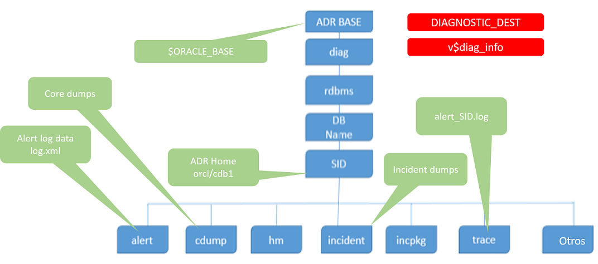
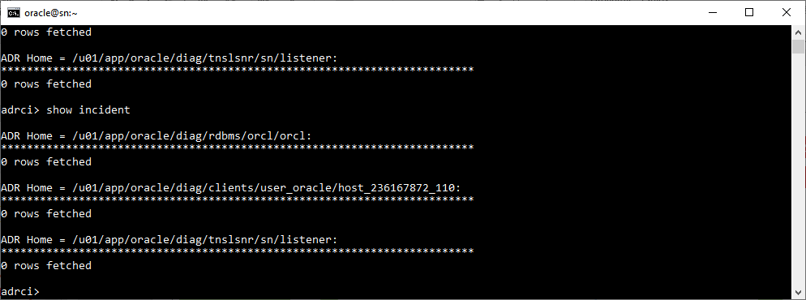

# **Práctica 8.3 Uso de la Herramienta ADRCI**

## **Objetivos**

* Verificar la estructura del repositorio ADR (ADR Base, ADR Home y archivos de traza).
* Utilizar la herramienta **ADRCI** para consultar alertas, problemas e incidentes.
* Filtrar mensajes de error en el archivo de alertas.
* Ejecutar comandos de purga para eliminar datos antiguos del repositorio.
* Comprender el uso práctico de ADRCI en la administración diaria de Oracle Database.

<br/><br/>

## **Duración estimada**

**30 minutos**

<br/><br/>

## **Tabla de ayuda**

| Comando                                | Descripción                                         | Ejemplo                                |
| -------------------------------------- | --------------------------------------------------- | -------------------------------------- |
| `show parameter diagnostic_dest`       | Muestra la ruta del repositorio ADR base            | `SQL> show parameter diagnostic_dest`  |
| `select name, value from v$diag_info;` | Muestra la información de ADR Base, Home y trace    | —                                      |
| `adrci`                                | Inicia la herramienta de línea de comandos ADRCI    | `$ adrci`                              |
| `help`                                 | Muestra la lista de comandos disponibles en ADRCI   | `adrci> help`                          |
| `show home`                            | Muestra las instancias registradas en ADR           | `adrci> show home`                     |
| `set base`                             | Define manualmente la ruta base de ADR              | `adrci> set base /u01/app/oracle`      |
| `set home`                             | Establece el home de trabajo de una instancia       | `adrci> set home diag/rdbms/orcl/orcl` |
| `show alert`                           | Muestra el archivo de alertas de la instancia       | `adrci> show alert`                    |
| `show problem`                         | Lista los problemas registrados en la base de datos | `adrci> show problem`                  |
| `show incident`                        | Lista los incidentes registrados en ADR             | `adrci> show incident`                 |
| `purge -age 43200`                     | Elimina información del ADR mayor a 30 días         | `adrci> purge -age 43200`              |
| `purge -age 43200 -type INCIDENT`      | Purga únicamente los incidentes antiguos            | —                                      |

<br/><br/>

## **Objetivo Visual**

El siguiente diagrama representa la estructura del **ADR (Automatic Diagnostic Repository)** y cómo se organiza la información de diagnósticos dentro del entorno Oracle:



<br/><br/>

## **Instrucciones**

### **Tarea 1. Verificación de la estructura ADR**

1. Conéctate a **SQL*Plus** como administrador:

   ```sql
   sqlplus / as sysdba
   ```

2. Ajusta el formato de salida:

   ```sql
   SET LINESIZE 100
   COLUMN name FORMAT A25
   COLUMN value FORMAT A65
   ```

3. Consulta la información del repositorio ADR:

   ```sql
   SELECT name, value FROM v$diag_info;
   ```

4. Muestra la ubicación base de los archivos de diagnóstico:

   ```sql
   SHOW PARAMETER diagnostic_dest;
   ```

<br/><br/>

### **Tarea 2. Iniciar ADRCI y verificar configuración base**

1. Desde el sistema operativo, inicia la herramienta:

   ```bash
   adrci
   ```

2. Si el valor de **ADR Base** aparece vacío, establécelo manualmente:

   ```bash
   adrci> set base /u01/app/oracle
   ```

3. Muestra la información de las instancias disponibles:

   ```bash
   adrci> show home
   ```

4. Verifica la ayuda general de comandos:

   ```bash
   adrci> help
   ```

5. Solicita ayuda específica sobre el comando `show alert`:

   ```bash
   adrci> help show alert
   ```

<br/><br/>

### **Tarea 3. Exploración del archivo de alertas**

1. Muestra el contenido del archivo de alertas de la instancia:

   ```bash
   adrci> show alert
   ```

   *(Esto abrirá el archivo en modo `vi`. Usa `[ESC] :q` para salir.)*

2. Filtra los mensajes de error que contengan el texto **ORA-**:

   ```bash
   adrci> show alert -p "message_text like '%ORA-%'"
   ```

3. Establece el home específico de la instancia **orcl**:

   ```bash
   adrci> set home diag/rdbms/orcl/orcl
   ```

4. Muestra las últimas cinco líneas del archivo de alertas:

   ```bash
   adrci> show alert -tail 5
   ```

<br/><br/>

### **Tarea 4. Visualización de problemas e incidentes**

1. Lista los **problemas** detectados en la instancia:

   ```bash
   adrci> show problem
   ```

2. Lista los **incidentes** registrados:

   ```bash
   adrci> show incident
   ```

3. Muestra el detalle de un incidente en particular (reemplaza `<número>` por el ID del incidente):

   ```bash
   adrci> show incident -mode detail -p "incident_id=<número>"
   ```

<br/><br/>

### **Tarea 5. Desafío**

1. Solicita ayuda sobre el comando `purge`:

   ```bash
   adrci> help purge
   ```

2. Elimina todo el contenido del repositorio ADR que tenga más de **30 días** (30 × 24 × 60 = 43200 minutos):

   ```bash
   adrci> purge -age 43200
   ```

3. Purga únicamente los **incidentes antiguos** mayores a 30 días:

   ```bash
   adrci> purge -age 43200 -type INCIDENT
   ```

4. Verifica nuevamente con:

   ```bash
   adrci> show problem
   adrci> show incident
   ```

<br/><br/>

## **Resultado Esperado**

Al finalizar la práctica, deberás:

* Comprender la estructura del **repositorio ADR** (Base, Home y traza).
* Navegar y consultar correctamente desde **ADRCI**.
* Visualizar los **mensajes de error ORA-**, **problemas** e **incidentes** activos.
* Ejecutar comandos de **purga** para mantener el repositorio limpio.
* Evidenciar tu trabajo mediante capturas del contenido de `show home`, `show alert` y la lista de problemas/incidentes.



