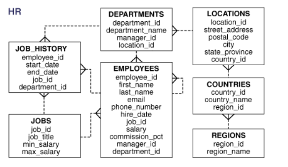
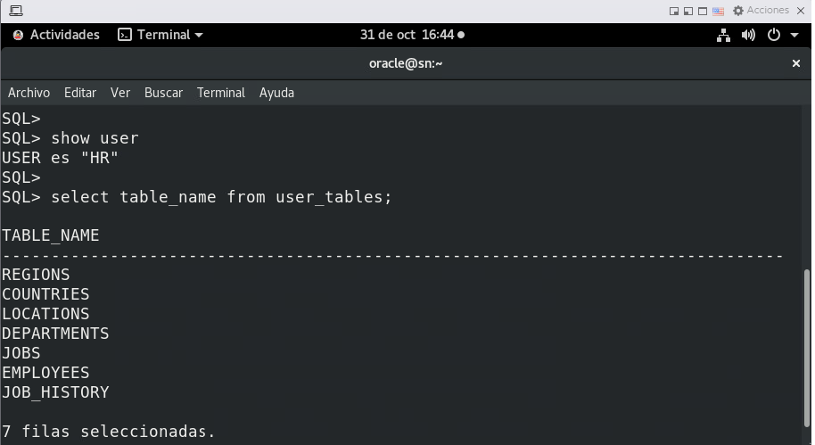

# **Práctica 1.2 SQL Básicos**

## **Objetivos**

1. Reconocer las tablas y relaciones principales del esquema **HR**.
2. Ejecutar sentencias `SELECT` con cláusulas `WHERE` y `ORDER BY`.
3. Aplicar alias de columna y tabla para mejorar la legibilidad de los resultados.
4. Utilizar variables de sustitución `&`, `&&`, `DEFINE` y `UNDEFINE` en SQL*Plus o SQL Developer.
5. Identificar y aplicar correctamente los operadores de comparación y lógicos (`=`, `<`, `>`, `LIKE`, `AND`, `OR`, `IS [NOT] NULL`).
6. Ejecutar consultas sobre la tabla `DUAL` para probar expresiones y funciones simples.


## **Duración estimada**

60 – 80 minutos


## **Tabla de Ayuda**

| Concepto                  | Descripción breve                                                                 | Referencia oficial Oracle                                                                                                                                            |
| ------------------------- | --------------------------------------------------------------------------------- | -------------------------------------------------------------------------------------------------------------------------------------------------------------------- |
| **HR Schema**             | Esquema de ejemplo con datos de empleados, departamentos, regiones y ubicaciones. | [Sample Schemas (HR)](https://docs.oracle.com/en/database/oracle/oracle-database/26/comsc/schema-diagrams.html#GUID-01BFEF14-C6BD-42CD-8558-DDD214DB3AE0) |
| `SELECT`                  | Recupera datos de una o más tablas o vistas.                                      | [SELECT Statement](https://docs.oracle.com/en/database/oracle/oracle-database/19/sqlrf/SELECT.html)                                                                  |
| `WHERE`                   | Restringe las filas que cumplen una condición.                                    | [WHERE Clause](https://docs.oracle.com/en/database/oracle/oracle-database/19/sqlrf/SELECT.html#GUID-F92B7817-0F8E-4A28-A5D4-8C86D4C1F5AE)                            |
| `ORDER BY`                | Ordena el resultado de la consulta.                                               | [ORDER BY Clause](https://docs.oracle.com/en/database/oracle/oracle-database/19/sqlrf/SELECT.html#GUID-4F09048A-8D26-44E8-8B51-8C86D4C1F5AE)                         |
| `DUAL`                    | Tabla especial de una sola fila utilizada para expresiones o funciones.           | [DUAL Table](https://docs.oracle.com/en/database/oracle/oracle-database/19/sqlrf/Selecting-from-the-DUAL-Table.html)                                                                          |
| `LIKE`, `%`, `_`          | Permite coincidencias parciales de texto con comodines.                           | [LIKE Condition](https://docs.oracle.com/en/database/oracle/oracle-database/19/sqlrf/Conditions.html#GUID-07E5F98B-BE58-4D7F-8360-7E06E166DF6B)                      |
| `IS NULL` / `IS NOT NULL` | Evalúa valores nulos correctamente (no usar `= NULL`).                            | [NULL Conditions](https://docs.oracle.com/en/database/oracle/oracle-database/19/sqlrf/Conditions.html#GUID-028B46A9-8E54-458D-8D6B-28EEEA5B8C76)                     |
| `&` y `&&`                | Solicitan entrada de usuario en SQL*Plus/SQLcl.                                   | [Using Substitution Variables](https://docs.oracle.com/en/database/oracle/oracle-database/21/sqpug/using-substitution-variables-sqlplus.html#GUID-68AC9FF2-B92A-48D1-9699-133D47F8DDC1)                                |
| `DEFINE` / `UNDEFINE`     | Define o elimina variables de sustitución.                                        | [DEFINE Command](https://docs.oracle.com/en/database/oracle/oracle-database/19/sqpug/DEFINE.html)                                                                    |
| `SET VERIFY ON`           | Muestra el valor sustituido de las variables.                                     | [SET VERIFY](https://docs.oracle.com/en/database/oracle/oracle-database/19/sqpug/SET.html#GUID-59B1A8EB-11A5-47A2-8C94-BA0D8A86525B)                                 |


<br/> <br/>

## **Objetivo Visual**

El diagrama representa la estructura de tablas relacionadas con la gestión de empleados, sus departamentos, puestos, ubicaciones geográficas y regiones. Las líneas punteadas indican las relaciones entre tablas mediante llaves foráneas (foreign keys).
 


<br/><br/>

## **Instrucciones**

### **Tarea 1. Verificar el modelo entidad-relación del esquema HR**

1. Accede al esquema **HR** (ya disponible en la base de datos).
2. Observa las tablas principales:

   * EMPLOYEES
   * DEPARTMENTS
   * JOBS
   * LOCATIONS
   * COUNTRIES
   * REGIONS
3. Abre el diagrama E-R proporcionado (en el material del curso o mediante SQL Developer):

   * En SQL Developer: **View → Data Modeler → Browser → HR Diagram**
   * O ejecuta el siguiente comando para listar las tablas:

     ```sql
     SELECT table_name FROM user_tables;
     ```
4. Identifica las relaciones clave:

   * `EMPLOYEES.DEPARTMENT_ID` → `DEPARTMENTS.DEPARTMENT_ID`
   * `DEPARTMENTS.LOCATION_ID` → `LOCATIONS.LOCATION_ID`
   * `LOCATIONS.COUNTRY_ID` → `COUNTRIES.COUNTRY_ID`
   * `COUNTRIES.REGION_ID` → `REGIONS.REGION_ID`
5. Registra en tus notas o en el archivo `.sql` una breve descripción de al menos tres relaciones (ejemplo: “Cada empleado pertenece a un departamento”).

<br/><br/>

### **Tarea 2. Verificar el entorno**

1. Inicia sesión con tu usuario asignado en SQL*Plus, SQLcl o SQL Developer.
2. Verifica la conexión ejecutando:

   ```sql
   SELECT user, sysdate FROM dual;
   ```
3. Confirma los parámetros regionales:

   ```sql
   SHOW PARAMETER NLS_TERRITORY;
   SHOW PARAMETER NLS_DATE_FORMAT;
   ```

<br/><br/>

### **Tarea 3. Recuperar datos básicos**

1. Consulta todas las filas de la tabla `EMPLOYEES`:

   ```sql
   SELECT * FROM employees;
   ```
2. Muestra solo el nombre, salario y departamento, renombrando las columnas:

   ```sql
   SELECT first_name AS Nombre, salary AS Salario, department_id AS "Depto"
   FROM employees;
   ```
3. Agrega un filtro para mostrar solo empleados con salario mayor a 8000:

   ```sql
   SELECT first_name, salary FROM employees WHERE salary > 8000;
   ```
4. Ordena el resultado por `salary` descendente:

   ```sql
   SELECT first_name, salary FROM employees WHERE salary > 8000 ORDER BY salary DESC;
   ```

<br/><br/>

### **Tarea 4. Operadores y valores NULL**

1. Ejecuta:

   ```sql
   SELECT first_name, commission_pct
   FROM employees
   WHERE commission_pct IS NULL;
   ```
2. Cambia la condición para mostrar solo quienes **sí** tienen comisión (`IS NOT NULL`).
3. Prueba el error clásico:

   ```sql
   SELECT first_name FROM employees WHERE commission_pct = NULL;
   ```

<br/><br/>

### **Tarea 5. Uso de la tabla DUAL**

1. Ejecuta operaciones matemáticas y funciones:

   ```sql
   SELECT 2*5 AS Resultado FROM dual;
   SELECT sysdate, add_months(sysdate, 3) AS "Tres Meses Después" FROM dual;
   SELECT upper('oracle sql') AS Mayusculas FROM dual;
   ```

<br/><br/>

### **Tarea 6. Variables de sustitución**

1. Ejecuta con `&` (solicita cada vez el valor):

   ```sql
   SELECT * FROM employees WHERE department_id = &dept_id;
   ```
2. Ejecuta con `&&` (guarda el valor para reuso):

   ```sql
   SELECT first_name, salary FROM employees WHERE department_id = &&dept_id;
   ```
3. Verifica el valor guardado:

   ```sql
   DEFINE
   ```
4. Elimina la variable:

   ```sql
   UNDEFINE dept_id;
   ```
5. Activa la verificación:

   ```sql
   SET VERIFY ON
   ```

<br/><br/>

### **Tarea 7. Combinar condiciones lógicas**

1. Muestra empleados del departamento 50 con salario > 7000:

   ```sql
   SELECT first_name, salary, department_id
   FROM employees
   WHERE department_id = 50 AND salary > 7000;
   ```
2. Agrega otra condición con `OR`:

   ```sql
   SELECT first_name, salary, department_id
   FROM employees
   WHERE department_id = 50 OR salary > 12000;
   ```
3. Observa cómo cambia el resultado al usar paréntesis:

   ```sql
   SELECT first_name, salary, department_id
   FROM employees
   WHERE (department_id = 50 AND salary > 7000) OR department_id = 90;
   ```

<br/><br/>

### **Tarea 8. Desafíos**

Ejecuta las siguientes 10 consultas utilizando el esquema **HR**.
No se muestran las soluciones; analiza el resultado esperado y valida tus consultas con base en la sintaxis y comportamiento de Oracle SQL.

1. Muestra los empleados cuyo nombre comience con la letra **A** y termine con **s**.
2. Obtén los empleados que **no tienen jefe asignado**.
3. Muestra el **nombre completo** (nombre + apellido) y el salario **aumentado en 10%**.
4. Lista los empleados contratados **después del año 2005**.
5. Obtén todos los empleados **del departamento de IT o de Sales**, ordenados por `hire_date`.
6. Muestra los empleados **con comisión no nula** y salario **superior a 8000**.
7. Lista los empleados cuyo **nombre tenga exactamente 5 caracteres**.
8. Usa una variable `&job_id` para mostrar los empleados de un trabajo específico.
9. Calcula el salario anual (salario * 12) de cada empleado y ordénalo de mayor a menor.
10. Muestra todos los departamentos con empleados cuyo **apellido contenga la letra “a”** y **salario > 9000**.

Guarda tus sentencias en el mismo archivo `practica1_2.sql` debajo de esta sección, separadas por comentarios:

```sql
-- Desafío 1

-- Desafío 2

-- Desafío 10 ...
```

<br/><br/>

### **Entrega sugerida**

(Opcional) Consulta con tu instructor asignado si habrá entregas correspondientes.
* Archivo `practica1_2.sql` con todos los comandos ejecutados y comentarios `-- Explicación`.
* Captura de pantalla del **diagrama E-R del esquema HR** (o lista de tablas y relaciones principales).
* Captura de pantalla con al menos dos consultas donde uses `&` y `&&`.
* Resumen final: tres líneas sobre lo aprendido y un ejemplo con `IS NULL`.

<br/><br/>

## **Resultado Esperado**

| Nº | Concepto evaluado                | Verificación                         |
| -- | -------------------------------- | ------------------------------------ |
| 1  | Uso correcto de `LIKE`, `%`, `_` | Coincide inicio/fin de patrón        |
| 2  | `IS NULL`                        | Devuelve pocos registros (1 o 2)     |
| 3  | Concatenación y cálculo          | Columna extra con aumento            |
| 4  | Comparación de fechas            | Fechas posteriores a 2005            |
| 5  | `OR`, `IN`, `ORDER BY`           | Departamentos correctos y orden      |
| 6  | `IS NOT NULL` + `AND`            | Solo filas con comisión              |
| 7  | Longitud con `_`                 | Nombres de 5 caracteres              |
| 8  | Variable `&` o `&&`              | Solicita o reutiliza parámetro       |
| 9  | Expresión aritmética             | Columna “anual” descendente          |
| 10 | `LIKE` + `AND` + `DISTINCT`      | Departamentos válidos sin duplicados |


<br/><br>

La salida confirma que el usuario HR está activo y que su esquema incluye las mismas tablas mostradas en el diagrama entidad-relación del esquema HR (como el de la imagen anterior). Estas tablas son utilizadas comúnmente para prácticas de SQL en Oracle, ya que ilustran relaciones jerárquicas entre regiones, países, ubicaciones, departamentos, empleados, trabajos e historial laboral.


